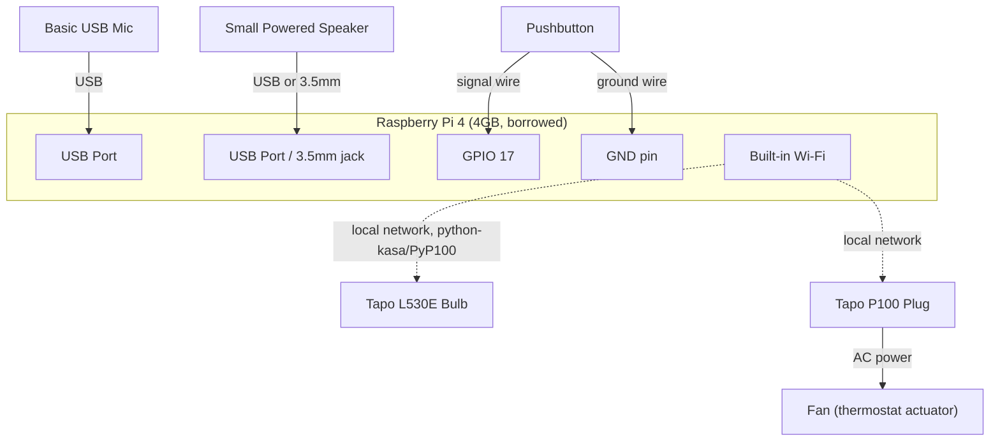
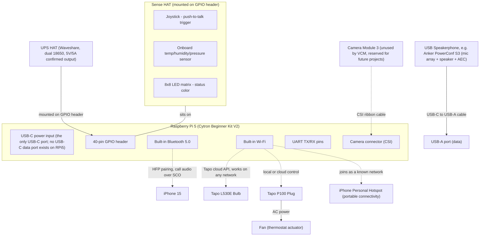

# Voice Command Model (VCM) — Architecture Review

Courses: AI222 (Supervised Learning) and AI231 (ML Operations), UP Diliman
Purpose of this document: capture the original assignment, the additional constraints from the adviser meeting, and every architecture decision made so far, so this can be handed to Claude Code (or read cold by a future collaborator) to continue the dataset and training work without re-deriving context.

**Tiering note**: hardware and scope are split into Tier 1 (needed to satisfy the graded requirements) and Tier 2 (portability/polish, pursued only once Tier 1 is proven working). This split exists to avoid over-investing effort in demo polish before the graded core, dataset, model, benchmark, validation, is solid.

---

## 0. Introduction (read this first)

This document exists so an AI assistant picking up this project cold, or a human collaborator, can understand what's being built and why without needing the conversation history that produced it.

**What we're building**: a tiny, on-device Voice Command Model (VCM) for a graduate machine exercise, submitted for both AI222 (Supervised Learning) and AI231 (ML Operations), UP Diliman. This is closed-set spoken intent classification, not automatic speech recognition and not an LLM. The model listens to a short spoken command, classifies it into one of a fixed set of intents (or an explicit "unknown/background" class), and triggers a corresponding real-world action, controlling a smart bulb, checking the weather, setting a timer, playing music, and so on, across ten command categories modeled on real smart-speaker usage data. The model must be small enough and fast enough to run in real time on a Raspberry Pi 4 or 5, entirely on-device for the recognition step, with no cloud model in that path (the resulting action is allowed to call the internet, e.g. a weather API or a bulb's control API, since that's execution, not understanding).

**Why the scope looks the way it does**: partway through planning this out, we deliberately stepped back and asked whether the hardware/demo ambitions were growing beyond what the assignment actually grades. The answer was yes, several portability and realism upgrades (real phone calls, cross-network bulb control, a nicer speakerphone, battery power) were solving problems the assignment never poses. The hardware list is now split into **Tier 1** (the minimum needed to satisfy the graded requirements: dataset, model, benchmark, validation, and a working real-time demo on an RPi) and **Tier 2** (portability and polish, deliberately deferred). If you're an AI assistant continuing this work, default to Tier 1 priorities unless explicitly told otherwise, the graded core (dataset quality, model performance, a defensible benchmark) matters far more than demo polish.

**What's actually graded** (from Section 1): building the dataset (collective), training the model (individual), designing a benchmark (collective), validating performance (individual), and a real-time demo on an RPi (individual, tier 1 hardware is sufficient). No LLM is permitted anywhere in the recognition path.

**Where things stand as of this document**: the architecture decisions (Section 3), hardware plan (Section 4), and candidate training datasets (Section 9) are settled enough to start building. The dataset itself (Section 9's candidates, plus whatever the class agrees on collectively) is the next concrete piece of work. Read Section 3 for the "why" behind each decision before proposing changes to it, several choices (e.g. dropping the SIM800L module, audio-only output, the Tier 1/Tier 2 split) were arrived at after considering and rejecting alternatives, documented inline so that reasoning isn't lost.

**How to use this document**: Sections 1–2 are the original assignment and constraints, unedited source material. Section 3 onward is our own analysis and decisions. Sections 4, 6, and 10 (hardware, task coverage, circuit diagrams) matter for the demo; Section 9 (candidate datasets) matters most for what to build next. Section 7 (open questions for the class) and Section 11 (future use cases, out of scope for this project) are explicitly not part of the current build.

---

## 1. Original Machine Exercise Instructions

ASR models are not desirable for on-device computing because of footprint. The goal is to build a tiny Voice Command Model (VCM) that can understand the most common commands humans tell their smart devices.

### Target commands (ranked, from Amazon Alexa / Google Home usage data)

1. Play music
2. Ask a question / search (weather, time)
3. Control lights (IoT) — turn on/off
4. Dim / color lights
5. Set a timer
6. Set an alarm
7. Adjust thermostat temperature
8. Media control — pause, stop, next/skip, volume
9. Reminders and lists
10. Calls and messaging

### Tasks

1. Build a dataset to train VCMs — collective work
2. Build and train a VCM on this dataset — individual work
3. Design a benchmark for validating VCMs — collective work
4. Validate the performance of your VCM — individual work
5. Build a real-world demo of your VCM (can run on RPi4/5) — individual work (may share devices)
6. VCM must be tiny — can run on RPi4 or 5 in real time
7. VCM should be standalone — cannot call cloud-based models
8. No LLM, just pure VCM doing 1–10, everything on-device

**Grading weight, inferred**: Tasks 1–4 (dataset, model, benchmark, validation) are individually and collectively assessed and computation-heavy; the demo (Task 5) is one task among eight with a comparatively simple bar: real-time on an RPi4/5, all ten categories handled, no cloud model for recognition. Effort should be weighted accordingly.

---

## 2. Additional Constraints (from adviser meeting)

1. Full ASR capability is not needed, only a subset that understands the listed commands.
2. Dataset approach needs class-wide discussion, but individual work can start ahead of that.
3. Accuracy alone was questioned as a benchmark; the class may need a shared benchmark definition.
4. Target: very high performance, under 3% error rate.
5. The device can connect to the internet, but must not call cloud-based *models* for the recognition step.
6. Hardware beyond the RPi itself (mics, sensors, microcontrollers, smart bulbs, Spotify-style APIs) needs to be scoped and sourced from what's available in the Philippines.
7. Currently holds a borrowed Raspberry Pi 4 (4GB) with no SD card, and intends to buy a Raspberry Pi 5. Wants the final result to be legitimately usable and well-presented, not a bare breadboard demo.

---

## 3. Key Architecture Decisions

- **Problem framing**: closed-set intent classification / spoken language understanding, not ASR and not an LLM task. Audio in, one of N intent labels out (plus an explicit "unknown/background" class), no transcription step.
- **On-device vs. internet boundary**: recognition (audio → intent) must run entirely on-device. Internet access is permitted for the *action* taken after recognition (weather API, smart bulb API, Spotify, phone call), since that is actuation, not understanding.
- **Model architecture**: DS-CNN or TC-ResNet style convolutional network over log-mel spectrogram features, for real-time CPU inference on RPi-class hardware without attention/transformer layers. Post-training INT8 quantization planned for latency.
- **Benchmark strategy**: accuracy alone rejected as the primary metric due to class imbalance in realistic "always listening" usage. Proposed benchmark: macro-F1 across intents, False Accept Rate / False Reject Rate against the background/unknown class (as a threshold curve, not a single number), a confusion matrix, and on-device latency. The under-3%-error target is proposed to apply to closed-set classification error under clean conditions, with open-set FAR/FRR reported separately. Pending the class-wide benchmark discussion (Task 3).
- **Dataset strategy**: see Section 9 for the full candidate-dataset research. Summary: seed from SLURP and Fluent Speech Commands (real, intent-labeled audio), Google Speech Commands v2 for the negative/background class, and Common Voice's accent-tagged English subset (including a small Filipino-accented portion) for accent-robustness material. In-class recorded data is still the primary way to cover Filipino-accented command phrases specifically, since no open dataset covers that combination at any real volume.
- **Scope discipline**: everything below Tier 1 is explicitly deferred until the dataset/model/benchmark work (the actually-graded core) is in good shape. Tier 2 items are documented so they aren't lost, not because they're scheduled next.

---

## 4. Hardware List

### Tier 1 — needed to satisfy the graded requirements

| Item | Purpose | Status |
|---|---|---|
| Cytron Raspberry Pi 5 Beginner Bundle V2 (8GB) | Main compute; already ordered, so Tier 1 development now targets the RPi5 directly rather than the borrowed RPi4 (see note below) | **[ORDERED]** |
| Borrowed Raspberry Pi 4 (4GB) | Fallback/parallel dev machine while the RPi5 kit is in transit | **[HAVE]** |
| Mini USB Microphone (Cytron) | Voice input; plug-and-play, no driver; already ordered | **[ORDERED]** |
| Small powered speaker (USB or 3.5mm) | TTS output, music, all audio feedback | **[BUY], cheap, not found at Cytron, source separately (Shopee/Lazada)** |
| TP-Link Tapo L530E smart bulb | Lights on/off, dim/color (categories 3–4) | **[DEFERRED] use the Xiaomi bulb already owned for Tier 1 instead (see note below); buy Tapo only if Tier 2 cross-network portability is pursued** |
| TP-Link Tapo P100 smart plug | Drives a fan for the thermostat command (category 7) | **[DEFERRED] use the Xiaomi smart plug already owned for Tier 1 instead; buy Tapo only if Tier 2 cross-network portability is pursued** |
| A physical pushbutton | Push-to-talk activation trigger | **[ORDERED]** one of the two pushbuttons bundled in the Cytron kit |
| Jumper wires (female-to-female) | Wiring the pushbutton directly to a GPIO pin and a ground pin; a breadboard is not required, see note below | **[ORDERED]** bundled in the Cytron kit |
| Micro-HDMI to HDMI cable/adapter | Initial OS setup and debugging before going headless over SSH (RPi4/5 use micro-HDMI, not standard HDMI) | **[ORDERED]** bundled in the Cytron kit |

Notes: temperature for category 7 can just use a simple rule-of-thumb or a bare-minimum sensor reading, don't spend time on sensor-accuracy debates at this tier. "Call mom" is mocked via TTS ("Calling Mom") rather than a real call. Music is a local file library via `mpv`/VLC.

**Update, Sept 14 2026**: the Cytron kit and Mini USB Microphone have already been ordered, so Tier 1 now develops directly on the RPi5 rather than treating the RPi5 as a Tier 2 upgrade path. The Tier 1/Tier 2 split remains meaningful as a *scope* boundary (what functionality is needed to pass, versus portability/polish), it's no longer a hardware-sequencing boundary for the Pi/mic specifically. The borrowed RPi4 is kept as a fallback so development isn't blocked while the kit is in transit; the Section 8 laptop-simulation plan is the actual near-term unblocker regardless of which Pi is on hand yet.

**Using the Xiaomi bulb and plug already owned, instead of buying Tapo devices**: local control is via `python-miio` (community-maintained, GPL-3.0, not an official Xiaomi-published API), which supports many Xiaomi/Mijia smart plugs and several bulb lines (Xiaomi/Philips co-branded bulbs directly, Yeelight-branded bulbs via its Yeelight module or the dedicated `python-yeelight` library). The exact bulb model needs checking against the supported-device list, "Xiaomi bulb" could be either family. Getting a local control token requires one cloud-authenticated step (`miiocli cloud` with the Mi account), after which control is fully local. Two caveats versus the Tapo plan: reliability is less guaranteed since this is reverse-engineered rather than officially supported (has been narrowed by Xiaomi firmware updates on some device generations/regions in the past), and there's no well-supported hobbyist path for cross-network cloud control the way Tapo has, so this covers Tier 1 (home network) well but doesn't solve the Tier 2 portability goal. Recommendation: use the owned Xiaomi devices for Tier 1 now, defer the Tapo purchase until Tier 2 portability work actually starts.

**Ordering sequence tip**: since the Cytron kit's bundle already includes jumper wires (all three types), a breadboard, two pushbuttons, and a micro-HDMI cable at no extra cost, it's worth placing the Cytron order early and using those bundled small parts for the Tier 1 build on the borrowed RPi4, rather than separately sourcing a pushbutton and jumper wires elsewhere. The bundled parts aren't tied to a specific Pi model.

**No breadboard needed**: the pushbutton circuit is simple enough to skip a breadboard entirely (though the kit includes one for free regardless). Using the Pi's software-enabled internal pull-up (instead of the external R1 resistor shown in the Section 10 schematic) reduces the wiring to two jumper wires, GPIO pin to one leg of the button, ground pin to the other leg. For a permanent Tier 2 build, soldering the leads to a small piece of perfboard is the next step up in durability.

### Tier 2 — portability and polish, pursued only after Tier 1 works end-to-end

| Item | Purpose | Status |
|---|---|---|
| Cytron Raspberry Pi 5 Beginner Bundle V2 | Bundles official case, PSU, microSD (32GB, pre-loaded with Raspberry Pi OS), Sense HAT, Camera Module 3, official micro-HDMI to HDMI cable, USB 2.0 microSD card reader/writer, breadboard, LEDs, resistors, jumper wires (male-female, male-male, female-female), two pushbuttons, and a buzzer | **[ORDERED]**, now the Tier 1 compute base too, see note above |
| USB conferencing speakerphone (e.g. Anker PowerConf S3 class device) | Consolidates mic + speaker + AEC into one compact, portable unit, replaces the Tier 1 Mini USB Microphone/basic speaker | **[BUY], not found at Cytron, source separately** |
| UPS HAT for Raspberry Pi (Waveshare, 5V/5A output, dual 18650 Li-ion) | Portable power for the Pi; mounts directly on the GPIO header, confirmed 5V/5A output, avoids the uncertainty of verifying a generic power bank's PD profile | **[BUY], deferred: not in the initial Cytron order, priority right now is getting Tier 1 working; revisit for later portability development** |
| iPhone 15 | Bluetooth HFP call endpoint for a real "call mom" | **[HAVE]** |
| Spotify Premium subscription | Real Spotify Web API playback control | **[HAVE]** |
| Sense HAT joystick or bundled pushbutton | Push-to-talk trigger, replaces the Tier 1 separately bought button | **[KIT]** |
| Camera Module 3 | Not used by this VCM; reserved for future computer vision projects | **[KIT]** |
| USB-A to USB-C adapter | The kit's bundled microSD reader is USB 2.0 / USB-A; a Mac has no USB-A port, so a small adapter is cheaper and simpler than buying a separate USB-C reader | **[BUY], cheap, check Cytron first, otherwise Shopee/Lazada** |
| PH plug adapter (shape only, not a voltage converter) | The Cytron kit and PSU ship with a UK-type plug; PH outlets are US-style flat-pin | **[BUY], cheap, any PH hardware/appliance store** |

**Dropped for now, not purchased in the initial order**: the DHT22 sensor was removed from the cart since it was backordered, and it was always optional, the Sense HAT's onboard temperature reading covers category 7 without it. Revisit only if that reading proves unusably inaccurate in practice. A dedicated display/monitor from Cytron was also considered and skipped: the device's output is audio-only by design (no display in the finished build), and setup/debugging is already covered by an existing home monitor plus the kit's bundled HDMI cable, or can skip a monitor entirely via Raspberry Pi Imager's headless setup (pre-configuring Wi-Fi and SSH before first boot).

**Dropped from the plan**: the SIM800L GSM module (and its antenna, level shifter, and buck regulator) is no longer part of this build. The Philippines is actively shutting down 2G, on which the SIM800L exclusively depends, DITO already runs no 2G network at all, and the NTC has mandated a full nationwide 2G shutdown by end of 2026. Bluetooth HFP to the iPhone 15 is now the only calling path, since it rides on the phone's real 4G/5G connection rather than a sunsetting radio standard. The Section 10 SIM800L schematic is retained below purely as a documented decision (what was considered and why it was dropped), not as something to build.

PH/Cytron sourcing notes: the Cytron kit and Mini USB Microphone are already ordered (see Tier 1 update above). DHT22 was dropped (Section 4); a UPS HAT can be added to a future Cytron order when Tier 2 portability work starts. The TP-Link Tapo devices and the speakerphone are consumer electronics outside Cytron's maker/component catalog and need a separate PH order (Lazada/Shopee) regardless. Cytron ships internationally to the Philippines with duties/taxes borne by the buyer (not bundled into the price the way it is for Malaysia/Singapore/Thailand). The Cytron kit ships with a UK-type plug; PH outlets are US-style, so a plug adapter is needed (see Section 4).

---

## 5. Software / Framework Stack

- **Development machine**: Mac M2 laptop (Apple Silicon, ARM-based, matters for local Python/PyTorch environment setup and any cross-compilation considerations for the RPi's own ARM architecture)
- **Model training**: UP's DGX cluster, not the local Mac or the Pi itself; training happens off-device and only the final quantized model is deployed to the Pi
- **DGX operational notes (from classmate reports, Sept 14 2026)**: the cluster's SLURM controller (`ai-swm`) has shown intermittent downtime (`scontrol ping` returning "Slurmctld(primary) at ai-swm is DOWN", `squeue` failing with "Unable to contact slurm controller"), and SLURM isn't installed/available on all compute nodes. A working submission pattern reported by a classmate: use an agent (e.g. Claude Code) logged into the DGX, submitting jobs via `bash <script>.sh` rather than assuming `sbatch`/SLURM is reliably available. Budget for this flakiness when planning training runs, don't assume the scheduler will be up on the first attempt.
- **OS**: Raspberry Pi OS, 64-bit (Debian-based)
- **ML training**: PyTorch (or TensorFlow), trained on UP's DGX cluster, exported and quantized (INT8) to TFLite or ONNX for on-device inference
- **Audio features**: log-mel spectrogram extraction, fixed-length windowing (~1–2s)
- **Model**: DS-CNN or TC-ResNet architecture
- **TTS**: Piper or espeak-ng, on-device, no cloud dependency, sole output modality (no display, by design, to keep the device small and portable)
- **Smart bulb/plug control (Tier 1)**: `python-miio` for the already-owned Xiaomi bulb and plug, local network only; requires a one-time cloud-authenticated token extraction (`miiocli cloud`), then fully local thereafter
- **Smart bulb control (Tier 2, if pursued)**: local LAN control (`python-kasa` / `PyP100`) for Tapo devices if purchased; Tapo's cloud API as the further upgrade for cross-network portability, since Xiaomi's local-only path doesn't solve that
- **Weather data**: a free weather API (e.g. OpenWeatherMap), a data lookup, not a model call
- **Music playback**: local media library via `mpv`/VLC for Tier 1; Spotify Web API for Tier 2 (Premium already held)
- **Calls (Tier 2)**: BlueZ (HFP Hands-Free role) + PipeWire for SCO audio routing, paired with the iPhone 15; this is the only calling path (see Section 4 for why SIM800L was dropped)
- **Network profile management (Tier 2)**: NetworkManager storing multiple Wi-Fi profiles, including the iPhone's personal hotspot as a portable fallback
- **Companion management interface (Tier 2, laptop-side, non-graded)**: a lightweight local web/REST interface on the Pi for Wi-Fi profile management, Tapo pairing, logs, and dataset/model tooling; not part of the recognition path and calls no cloud models

---

## 6. Task Coverage Checklist (Tier 1 baseline)

| # | Command | Hardware path | Software path |
|---|---|---|---|
| 1 | Play music | Speaker | Local media library via mpv/VLC |
| 2 | Ask a question / search | Speaker | On-device TTS + free weather API + system clock |
| 3 | Control lights (on/off) | Xiaomi bulb (already owned) | python-miio, local LAN |
| 4 | Dim / color lights | Xiaomi bulb (same device) | python-miio |
| 5 | Set a timer | Speaker | Software-only, local scheduling |
| 6 | Set an alarm | Speaker | Software-only, local scheduling |
| 7 | Adjust thermostat | Sense HAT sensor (or basic reading) + Xiaomi smart plug (already owned) + fan | Sensor read + python-miio plug control |
| 8 | Media control | Speaker | Local player control (mpv/VLC) |
| 9 | Reminders and lists | Speaker, SD card storage | Software-only, persistent local storage |
| 10 | Calls and messaging | None (mocked) | TTS says "Calling Mom", no real call |

All ten categories are covered at Tier 1, now on the ordered Cytron RPi5 kit and Mini USB Microphone, with no further purchases required. Tier 2 upgrades each category's realism (real call, real Spotify, cross-network bulb control via Tapo) without changing which categories are covered.

---

## 7. Open Questions for the Class

- Final shared dataset collection protocol (recording setup, speaker diversity, class balance)
- Final shared benchmark definition: held-out test set composition, background/foreground ratio, and whether the under-3%-error target applies to closed-set classification only or some combined metric
- Whether slot-filling (extracting numeric values like timer duration, alarm time, target temperature) is in scope for this exercise, or whether intent classification alone is sufficient. **Update**: classmate Mark Andrian Macalalad's draft schema (Section 9, Dataset Schema review) answers this with a concrete fixed-vs-slotted taxonomy, pending class-wide adoption.
- **Label taxonomy**: a more granular draft is now circulating among classmates (see Section 9, Class Progress Notes), expanding the original ten categories into per-action classes. Needs to be finalized and formally adopted or amended as a class, not adopted unilaterally from an informal chat thread.
- **Whether synthetic/self-generated data is permitted at all**: as of the Sept 14 2026 class discussion, this is genuinely unresolved, one classmate recalled the adviser warning that self-generated data would be difficult, not necessarily that it's disallowed, but this was secondhand and unconfirmed. **Working assumption as of Sept 14 2026: proceeding as if synthetic data is allowed**, so this doesn't block dataset progress. This is an assumption, not a confirmed answer, still get a direct answer from the adviser, and be ready to strip synthetic data back out if the assumption turns out wrong.

---

## 8. Next Steps

- Wire up Tier 1 hardware and confirm all ten intents produce a visible/audible action end to end
- Source and evaluate SLURP and Fluent Speech Commands against the target taxonomy (see Section 9)
- Draft a proposed label taxonomy (including the explicit "unknown/background" class) to bring to the class dataset discussion
- Stand up the training/quantization pipeline against the seed datasets so it's ready to swap in the class-wide dataset once finalized
- Only after the above is solid: move to Tier 2 (Cytron kit, speakerphone, portability, real calling/Spotify)

### Laptop simulation while hardware is in transit (instructions for Claude Code)

The RPi-specific parts of this build are a small fraction of the total pipeline. Everything else can be built and genuinely tested on the Mac M2 right now, not just stubbed out, so hardware arrival should not be a blocker for starting real implementation work. When building this, structure the code with a clear hardware abstraction boundary from the start, so nothing needs rewriting when the RPi arrives, only the boundary's implementation swaps.

**Build and test for real, on the Mac, today:**
- Audio capture, using the Mac's built-in microphone in place of the eventual USB mic. Same Python audio libraries work on both platforms.
- Feature extraction (log-mel spectrograms) and model inference. Export the trained model (from the UP DGX cluster) to TFLite or ONNX and run it directly on macOS. This validates classification *correctness* now. It does not validate real-time *latency* on RPi-class hardware, the M2 is far more powerful than an RPi CPU, so timing measured here is not representative; latency validation still has to happen on the actual RPi once it arrives. Keep these two concerns (correctness vs. real-time performance) explicitly separate in any test reporting.
- Smart bulb and plug control, for real, against the actual Xiaomi devices already owned. `python-miio` runs over the local network from any machine on it, including the Mac, so this integration doesn't need to wait for the RPi at all.
- TTS output. Piper/espeak-ng both run on macOS; macOS's built-in `say` command is also fine for quick ad hoc testing.
- Music playback (local library via `mpv`/VLC, or Spotify Web API) and the weather API call. Neither has any RPi dependency.

**Mock behind the hardware abstraction boundary, until the RPi arrives:**
- The push-to-talk button: substitute a keyboard key press (e.g. hold spacebar to simulate "button held") as the trigger signal on the Mac.
- The Sense HAT's onboard temperature reading: substitute a fixed or randomly-varied mock value returned from the same function signature the real sensor read will use.
- The Sense HAT's LED matrix status indicator and the Camera Module 3: not exercised by the VCM at all (camera is explicitly unused, see Section 4), skip both entirely rather than mocking them.

**Recommended structure**: one module/interface per hardware-dependent function (`get_button_press()`, `read_temperature()`), with a Mac implementation and an RPi (GPIO/`gpiozero`) implementation behind the same function signature, selected by a config flag or platform detection at startup. This is the same discipline already established for the dataset loader (Section 3: keep data loading, feature extraction, and model code decoupled), applied to hardware I/O instead of data sources.

---

## 9. Candidate Datasets for VCM Training

**Directly usable, real recorded speech with intent labels:**

- **SLURP** (Bastianelli et al., 2020): ~72,000 audio recordings across 18 domains, including alarm, calendar/datetime, weather/qa, music/play, IoT (lights), email, lists, transport, news, and general assistant queries. The closest match in breadth to the full ten-category taxonomy. The GitHub repo (`pswietojanski/slurp`) holds only the text-side annotations (`train.jsonl`, `devel.jsonl`, `test.jsonl`); the actual audio (~6GB of FLAC files) is hosted separately on Zenodo and fetched by running the repo's `scripts/download_audio.sh`, which populates `slurp_real` (genuine crowdsourced recordings) and `slurp_synth` (synthetic TTS-generated audio used to pad slot-value coverage) folders referenced by the jsonl files. Prefer `slurp_real` as the primary source; treat `slurp_synth` as optional bulk.
- **SLURP** (Bastianelli et al., 2020): ~72,000 audio recordings across 18 domains, including alarm, calendar/datetime, weather/qa, music/play, IoT (lights), email, lists, transport, news, and general assistant queries. The closest match in breadth to the full ten-category taxonomy. The GitHub repo (`pswietojanski/slurp`) holds only the text-side annotations (`train.jsonl`, `devel.jsonl`, `test.jsonl`); the actual audio (~6GB of FLAC files) is hosted separately on Zenodo and fetched by running the repo's `scripts/download_audio.sh`, which populates `slurp_real` (genuine crowdsourced recordings) and `slurp_synth` (synthetic TTS-generated audio used to pad slot-value coverage) folders referenced by the jsonl files. Prefer `slurp_real` as the primary source; treat `slurp_synth` as optional bulk. **Confirmed friction, Sept 14 2026**: a classmate reported being unable to pull the audio from Zenodo directly; if this recurs, check for a HuggingFace-hosted mirror before spending more time on the Zenodo path. Also worth knowing before training: SLURP's phrases run long (full natural-language sentences), which one classmate found made it harder to train a clean short-command classifier from directly, may need trimming/selection rather than using full utterances as-is.
- **Fluent Speech Commands (FSC)**: 30,043 real crowdsourced utterances from 97 speakers, 16kHz mono wav. Narrower scope, smart-home style commands only (lights, heat, volume, music), good fit for categories 1, 3, 4, 7, 8; does not cover weather, timers, alarms, reminders, or calls. **Confirmed by classmate EDA (Sept 14 2026)**: specifically missing coverage for search/weather, set timer, set alarm, reminders/lists, and calls/messaging, and lacks specific vocabulary needed elsewhere in the taxonomy, numbers ("two," "30 percent," "twenty degrees") and media-control phrasing like "next/skip" are absent.
- **Snips SLU Dataset** (smart-lights / smart-speaker subsets): smaller (~1,660 clips), real audio, single sentence per recording, supplementary source for the lighting domain. Also available as a HuggingFace dataset (`MWilinski/snips_slu_v1.0`), which may be an easier access point than sourcing it directly given the Zenodo friction noted above for SLURP.

**Keyword-level, for the "unknown/background" negative class:**

- **Google Speech Commands v2**: 105,829 one-second utterances from 2,618 speakers, 35 keyword classes plus explicit background-noise clips. Not intent-labeled; the standard source for training rejection of non-command audio, directly relevant to the FAR/FRR benchmark framing. Also available via HuggingFace (`google/speech_commands`) as an alternative access point.

**Accent diversity sources:**

- **Mozilla Common Voice (English subset)**: crowdsourced read speech with self-reported accent tags. A published extraction found roughly 1,895 utterances (2.5 hours) tagged "Philippines," alongside larger England, Indian, and Australian subsets. Read sentences, not command phrases, best used as background/negative audio or accent-robust pretraining rather than as labeled command data directly.
- **Indian EmoSpeech Command Dataset**: real Indian-accented command-style recordings with authentic background noise. Different keyword set than the target taxonomy, but a useful reference point, and phonologically closer to Philippine English than the North American accents dominating FSC/GSC.

**The gap, explicitly**: no open dataset provides Filipino-accented *command phrases* at meaningful volume, only ~2.5 hours of unrelated read speech from Common Voice. The class's own recorded data remains the primary way to close this gap; open datasets serve as the seed/pretraining layer.

**Synthetic augmentation option, proceeding under an unconfirmed assumption of permission (see Section 7)**: several TTS providers offer ready-made Filipino-accented English voices (ElevenLabs has multiple voices tagged as Filipino/Manila-accented, with a free tier of 10,000 characters/month; other platforms list dedicated en-PH neural voices), and voice cloning (ElevenLabs' cloning feature, or open-source tools like Coqui XTTS/OpenVoice) can turn a small amount of real recorded classmate speech into a much larger volume of synthetic command-phrase variations in that same authentic accent. This is a published, legitimate technique for this exact use case in general, a dataset called SynTTS-Commands exists specifically as a public KWS dataset built from TTS-synthesized multilingual speech. **As of Sept 14 2026, the class is working under the assumption that synthetic data is allowed, pending direct confirmation from the adviser**; this is a deliberate working assumption to keep dataset progress moving, not a settled answer, and should be revisited if the adviser says otherwise. One classmate's synthetic-data experiments also independently confirmed the expected limitation regardless of the compliance question: a first-generation TTS voice trained well in isolation but failed to generalize to real human voices at inference time, exactly the synthetic-to-real gap this document already flagged. Treat synthetic data strictly as a volume-boosting supplement layered on top of real recordings, not a replacement, given that demonstrated generalization gap.

**Real recordings, independently confirmed to matter**: a classmate's own experiment found that adding personal voice recordings to the "Call" label noticeably improved that class's classification quality, direct empirical support for prioritizing real recorded data over relying on open/synthetic sources alone, consistent with this document's existing recommendation.

**Note on MASSIVE**: MASSIVE (Amazon's 51-language NLU dataset) was considered earlier but is text-only for its translated languages; audio exists only for the original English portion, which is SLURP itself. It does not add audio coverage beyond what SLURP already provides.

## Class Progress Notes (as of Sept 14, 2026)

Captured here so this document reflects where the collective dataset effort actually stands, not just what was planned in isolation.

- **A preliminary combined tally** from one classmate's early compilation: SLURP (11,353 recordings), Fluent Speech Commands (22,534), Google Speech Commands v2 "stop" keyword (3,783), Google Speech Commands background noise (180), totaling 37,850 recordings. This is a snapshot of one classmate's in-progress compilation, not a finalized class dataset, treat as a rough indicator of scale rather than a settled number.
- **A more granular draft label taxonomy is circulating**, expanding well beyond this document's original ten broad categories into per-action classes: Add to list, Call, Change light color, Dim lights, Lights off, Lights on, Show reminders, Next/skip, Pause, Play music, Search, Send message, Set alarm, Add reminder, Background/silence, Stop, Temperature down, Temperature up, Time, Unknown speech, Volume down, Volume up, Weather. Reported split (train/validation/test) is roughly 28,000/7,400/5,500 recordings, but these exact figures come from a photographed spreadsheet and should be verified against the live source before being treated as authoritative. Some classes in that draft carry an asterisk in the source table with an unstated meaning (possibly data-scarcity or provisional-source flags, e.g. "Call" shows only 13 total samples), worth asking the class to clarify. This taxonomy is more actionable than this document's original ten-category framing and should probably supersede it once confirmed, since it splits compound categories (e.g. "media control," "lights," "reminders and lists") into the individual actions a classifier actually needs to distinguish.
- **The Common Voice-via-transcription approach has a subtlety worth flagging**: one classmate proposed mining Common Voice's large volume of short clips for needed vocabulary by first running general speech transcription, then mapping transcribed words to commands. This is fine as an offline *dataset-curation* technique, it never touches the deployed model, but it's worth being explicit in any documentation that the deployed VCM itself still goes directly from audio to intent with no transcription step at inference time, so this doesn't reintroduce the ASR dependency the assignment rules out. The added pipeline complexity (recording → transcription → command mapping, versus directly labeled data) is a real cost of this approach worth weighing against just using already-labeled sources.
- **A voice-cloning synthesis pipeline, worth replicating or improving on**: a classmate (Anthony Navarez, GitHub `Martinnavs`) shared a working approach for generating synthetic command audio via voice cloning (data folder named `cosy-voice-data`, using the [CosyVoice](https://github.com/QwenAudio/CosyVoice) open-source voice-cloning TTS model): one recorded example of the target prompt (e.g. a real "Play Music" recording) plus several reference audio clips are used to synthesize additional command variations in that voice. Reported informal spot-checks were promising, though not yet formally benchmarked. Planned next step from the same classmate: overlaying noise and home-environment background audio onto the synthetic outputs, which directly addresses the "synthetic audio lacks real-world acoustic conditions" limitation already flagged in this document, worth adopting regardless of what else changes. Also worth noting: this classmate's stated deployment plan matches this document's own framing exactly, text transcription is used only for *offline dataset labeling*, while the actual served model, given a small closed set of commands, outputs a numeric class index mapped directly to the corresponding action, no transcription step at inference time. **Follow-up, same classmate**: a second repo, [`simple-audio-transcriber`](https://github.com/Martinnavs/simple-audio-transcriber), automates quality control on the synthetic output, it transcribes each generated clip and checks whether the transcription matches the intended filename/label (e.g. does "Lights off.wav" actually transcribe back to "Lights off"), producing a confidence score; low-confidence clips get routed to human spot-check rather than blindly trusted. This is a sensible QA gate worth adopting for any synthetic data this project uses, regardless of which generator produces it. Resources: [Google Drive folder](https://drive.google.com/drive/folders/1P2zogBUNzHAHW0IA3cNTFJgmwi8Ymlvo?usp=sharing) (raw voice-cloning inputs in `cosy-voice-data/`, generated outputs in `conversions/`, note from the author that some outputs are lower-quality and need filtering) and a [process writeup on GitHub](https://github.com/Martinnavs/AI-222-Machine-Exercises/tree/ME2/ME2) (branch `ME2`, folder `ME2`; blocked from automated fetching here by the repo's robots.txt, but `git clone`-able directly by Claude Code). This is explicitly not meant to be copied wholesale, but is a concrete, working starting point for the dataset's synthetic-augmentation layer, proceeding under the working assumption (Section 7) that synthetic data is permitted, pending the adviser's actual confirmation.
- **A design-reliability question already answered by an earlier decision**: a classmate (Ailene) raised a concern about how much memory an always-listening device would need. This document already avoided that problem entirely, the Tier 1 design uses a push-to-talk trigger specifically to avoid continuous listening (Section 3), so this isn't an open risk for this build, worth mentioning back to her as a solved question rather than something needing new investigation.
- **The class's shared dataset/benchmark/device tracker spreadsheet** (`AI231_ME2.xlsx`, three sheets: Datasets, Benchmarks, Device) shows real progress on the Datasets sheet and nothing yet logged on Benchmarks or Device, consistent with Section 7's open items. Concrete findings from the Datasets sheet:
  - **Mark Andrian Macalalad's synthetic experiments are now fully identified**: "Data2," the robotic-sounding first attempt he mentioned in chat, is [eSpeak NG](https://github.com/espeak-ng/espeak-ng) (a formant-based, non-neural TTS engine), 10,000 recordings (20 labels × 10 synthetic voices × 10 phrases × 5 speed/pitch/volume variations), which explains the poor generalization to real voices. "Data3," his stronger follow-up, uses [Chatterbox TTS](https://github.com/resemble-ai/chatterbox) (a neural voice-cloning model) with reference speakers from LibriSpeech and Common Voice, targeting 9,000 recordings (20 labels × 30 reference speakers × 5 phrases × 3 variants). This one has genuinely good methodology worth highlighting to the class as a template: an explicit **speaker-disjoint** train/val/test split (training: 20 LibriSpeech + 4 Filipino-English speakers; validation and test: 2 LibriSpeech + 1 Filipino-English speaker each, held out from training) and deliberate inclusion of Filipino-English reference speakers (6 of 30 total, 15M/15F overall), a direct, already-in-progress answer to this document's Filipino-accent gap.
  - **Cherry Magdaong's find**: [`SynTTS-Commands-Official`](https://github.com/lugan113/SynTTS-Commands-Official), the actual repo behind the SynTTS-Commands academic dataset referenced earlier in this document (previously cited generically, now with a concrete source). Built using CosyVoice2, the same model family Anthony's pipeline uses. Already contains 14k recordings for command 1 and 53k for command 8 per the original numbering, a large, precedented, ready-made resource worth checking against the taxonomy before generating more synthetic data from scratch.
  - **Joven Daniel Nepomuceno's finds**: a [Kaggle notebook](https://www.kaggle.com/code/bhataakib02/echoedgemarvinwithvadfinal) pairing Google Speech Commands v0.02 with a working voice-activity-detection (VAD) keyword-spotting pipeline, useful purely as a reference implementation (this project's own activation design already settled on push-to-talk over VAD/always-listening, per Section 3); a [Kaggle synthetic single-word dataset](https://www.kaggle.com/datasets/jbuchner/synthetic-speech-commands-dataset) covering words like "off," "on," "stop"; and the same Fluent Speech Commands Kaggle mirror already documented above.
  - **King Villasin's Common Voice note**: clarifies the full Common Voice English corpus is roughly 200,000 recordings across many accents (the ~1,895-utterance Philippines-tagged subset cited earlier in this document is a small slice of that larger total, not a separate number).
- **How this build is using classmates' contributions, Sept 17 2026**: this project's dataset pipeline is explicitly built *on top of* work already shared in the class, not developed in isolation. Concretely: the working taxonomy is Mark Andrian Macalalad's fixed-vs-slotted schema, adopted as-is (see the Draft Label Taxonomy Review section below), with a cell-type bug found and flagged back to him; the plan for synthetic data generation, if a real coverage gap remains after checking real sources, is to extend Mark Andrian's speaker-disjoint Chatterbox TTS methodology rather than invent a separate approach, since it already targets the Filipino-accent gap with real rigor; the synthetic-data QA step being built generalizes Anthony Navarez's `simple-audio-transcriber` transcribe-and-compare pattern so it can screen any generator's output, not just his own; and before generating any new synthetic audio at all, Cherry Magdaong's `SynTTS-Commands-Official` find is being checked for existing coverage, to avoid the class duplicating effort. Each of these gets a direct follow-up note to the classmate whose work it builds on as the corresponding tooling lands, not just this one acknowledgment.

## Draft Label Taxonomy Review (`Dataset Schema`, credit: Mark Andrian Macalalad)

**Correction, Sept 17 2026**: this schema was previously (and incorrectly) attributed to Quiel in this document. It's classmate **Mark Andrian Macalalad's** work — shared into the class Drive folder "AI 231 MEX2 Dataset" (which he owns) alongside a "1 fixed phrase/command_50 speakers" recordings subfolder, suggesting the class has already started collecting real audio against it. This project is adopting it as its working taxonomy and building on it, not proposing an alternative.

Structured more cleanly than the ten broad categories this document started with: **13 fixed-phrase intents** (PLAY_MUSIC, WEATHER, TIME, LIGHT_ON, LIGHT_OFF, PAUSE, STOP, NEXT, VOLUME_UP, VOLUME_DOWN, CALL, MESSAGE, LIST_REMINDERS) plus **6 slotted intents** (TIMER{duration}, ALARM{time}, TEMPERATURE{degrees}, BRIGHTNESS{percent}, COLOR{color}, CREATE_REMINDER{task}). This explicitly answers Section 7's open question on whether slot-filling is in scope, this schema says yes, with a clean fixed-vs-slotted split, which is a stronger design than treating every command as a flat label. Three sheets (Option A/B/C) offer the same 19 intents at increasing richness, 2 vs. 3 phrasing variations per intent and 2 vs. 3 example slot values per slotted intent, a reasonable way to scale up phrase coverage without changing the taxonomy itself.

**A real bug to fix before this schema is used to generate anything, independently verified Sept 17 2026** (downloaded the live sheet as .xlsx and inspected cell types directly with openpyxl, `data_only=True`): the ALARM intent's slot values aren't stored as plain text the way every other slot is ("10 seconds," "18 degrees," "Red"). Confirmed across all three sheets (Option A/B/C): the ALARM row's time cells are genuine Python `datetime.time` objects (`h:mm am/pm` number format), not strings, e.g. Option A holds `datetime.time(6, 0)` and `datetime.time(8, 0)`; Options B/C add a third value, `datetime.time(21, 0)`, which renders correctly as "9:00 PM" (an earlier read of this bug suspected a stored/displayed mismatch there, showing "8 PM" instead, that specific discrepancy did not reproduce on direct inspection, the type bug is the real, confirmed issue). If a data-generation script reads this file with pandas or openpyxl as-is, the ALARM slot will come back as a `time` object instead of the same "6 AM"-style string every other slot produces, and will silently break any code that assumes every example-value cell is text. Fix at the source: reformat that column as Text and retype the values as literal strings ("6 AM", "8 AM", "9 PM") before this schema feeds any generation pipeline. Flagged directly to Mark Andrian since it's his file.

**Reconciling with the other draft taxonomy** (the ~23-class spreadsheet noted earlier in this section, with entries like "Add to list," "Dim lights," "Change light color"): the two drafts cover mostly the same ground with different structuring choices, this schema's BRIGHTNESS/COLOR/CREATE_REMINDER slotted intents roughly correspond to that spreadsheet's "Dim lights"/"Change light color"/"Add reminder" entries. Worth reconciling explicitly as a class rather than each classmate's draft quietly becoming a de facto standard; this schema's fixed-vs-slotted structure is worth proposing as the reconciling frame, since it resolves the slot-filling scope question the other draft doesn't address.

**How this project is using it**: `quielq-vcm`'s dataset pipeline (see the repo's own README/commits) adopts this taxonomy as its working schema rather than the ten broad categories this document started with, and builds a loader against it directly, decoupled from audio so it's ready to consume whichever recordings the class collects. The taxonomy itself isn't being modified, only the cell-type bug above and the tooling built around it.

---

## 10. Circuit / Wiring Diagrams

These are block/wiring diagrams, not full electrical schematics, most connections here are USB, Wi-Fi, or Bluetooth rather than raw analog circuitry. The pushbutton and the optional SIM800L module are the only parts with actual pin-level wiring. Both render as diagrams in Mermaid-compatible viewers (GitHub, VS Code with the Mermaid extension, Claude Code).

### Tier 1

Notes: the pushbutton wires to any free GPIO pin (GPIO 17 used here as an example) with the other leg to a ground pin, read in software as a simple digital input, no pull-up/pull-down resistor needed since Raspberry Pi OS's GPIO library can enable the internal pull-up in software. The bulb and plug are not wired at all, they're separate Wi-Fi devices controlled entirely over the network.

### Tier 2

Notes: the Sense HAT connects by sitting directly on the 40-pin header, no individual wiring required. The speakerphone and UPS HAT are plug-and-play over USB-C / the GPIO header respectively. Bluetooth and Wi-Fi are radio links, not physical wiring. The SIM800L branch shown in the schematic below is retained for documentation only, it is dropped from the actual build (see Section 4: the Philippines' 2G shutdown removes the network this module depends on).

### Schematic-level detail: the two parts with actual electrical design

The block diagram above covers every connection actually built. Two schematics are kept below for reference: the Tier 1 push-to-talk button, which is part of the real build, and the SIM800L power/logic interface, which documents a design that was considered and then dropped (Section 4), kept here so the reasoning and the electrical caveats aren't lost if cellular calling is ever revisited on a different module.

**Tier 1 — push-to-talk pull-up circuit**

GPIO 17 reads HIGH by default (pulled up to 3.3V through R1) and reads LOW the instant the button is pressed, connecting the pin to ground. This is the standard debounced-in-software button pattern; Raspberry Pi OS's GPIO library can also enable an internal pull-up so R1 is optional in practice, it's shown here for clarity and because an external resistor is more reliable if the button ever moves to a different board.

**Dropped: SIM800L power and level-shifting circuit (kept for reference only, not built)**

This schematic documents what the SIM800L path would have required: its own regulated 4V rail stepped down from the Pi's 5V via a buck regulator, a large reservoir capacitor to absorb the current spikes GSM transmission draws, and level-shifted UART lines since its logic levels don't match the Pi's 3.3V GPIO. None of this is being built, the module is 2G-only and the Philippines' 2G network is being phased out nationwide by end of 2026 (already absent on DITO). Retained here in case a 4G-capable cellular module is considered for a future project.

---

## 11. Future Use Cases for the RPi5 Hardware (Beyond This ME)

Noted here for reference, not part of this project's scope or cost plan, so the RPi5 investment isn't a single-purpose purchase.

- **Raspberry Pi AI HAT+ 2** (Hailo-10H accelerator, 8GB onboard RAM, sold directly by Cytron): purpose-built for running LLMs/VLMs locally on an RPi5, with working reference projects (e.g. Ollama running directly on the Hailo accelerator) already demonstrated in the community. This is a direct hardware match for the ASA Philippines local-first AI work (the Ollama + Qwen2.5 3B incident-report extraction pipeline and the privacy-first commercial product for BSP-regulated institutions), letting that pipeline be prototyped or demoed on dedicated, accelerated, fully offline hardware rather than a laptop. Requires proper active cooling and the 5A@5V PSU already covered by the kit purchase.
- **Cheaper alternative for vision-specific work**: the plain Raspberry Pi AI HAT+ (Hailo-8L or Hailo-8, 13 or 26 TOPS) is aimed at camera-based inference rather than LLMs, a better fit if a future project leans toward object/vision detection (e.g. an illustrative demo prop for the AI literacy workshop project) rather than local language models.
- **Caveat worth knowing before buying either**: the AI HAT+ variants use the Pi 5's PCIe bus, which means an NVMe SSD cannot be used on the same board at the same time (an NVMe-via-USB adapter is the workaround if both are wanted).
