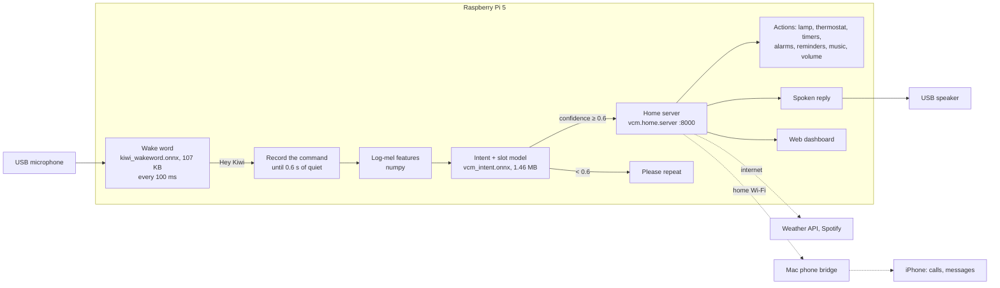

# Architecture

How the Voice Command Model (VCM) is built, as shipped: the Experiment 43b
intent + slot model and the Experiment 43 "Hey Kiwi" wake word. How the
design got here, including the original plan and the earlier models, is in
[EXPERIMENTS.md](legacy/EXPERIMENTS.md).

Courses: AI222 (Supervised Learning) and AI231 (ML Operations), UP Diliman.

## 1. The assignment

> ASR models are not desirable for on-device computing because of footprint.
> The goal is to build a tiny Voice Command Model (VCM) that can understand
> the most common commands humans tell their smart devices.

Target commands, ranked from Amazon Alexa / Google Home usage data:

1. Play music
2. Ask a question (weather, time)
3. Lights on/off
4. Dim / color lights
5. Set a timer
6. Set an alarm
7. Adjust the thermostat
8. Media control: pause, stop, next, volume
9. Reminders and lists
10. Calls and messaging

Tasks: build a dataset (collective), build and train a VCM (individual),
design a benchmark (collective), validate the VCM (individual), and build a
real-world demo that runs on a Raspberry Pi 4/5 (individual).

Constraints: tiny enough to run in real time on a Raspberry Pi; standalone,
with no cloud models; no LLM; a wake word instead of a button. From the
adviser meeting: only the listed commands are needed, not full ASR; the
device may use the internet for *actions* (weather, Spotify) but not for
*recognition*; the class discussed a target of under 3% error.

## 2. System overview

Recognition (everything up to the model's output) runs on the Pi with no
network. Only actions use the network: the weather API, Spotify, and the
Mac that relays calls and messages to the iPhone.

Two processes run on the Pi as systemd user services, restarted within 3 s
if they exit:

| Service | Program | Job |
|---|---|---|
| `vcm.service` | `scripts/vcm_listen.py` | Microphone → wake word → command recording → intent + slot model → HTTP POST to the home server |
| `vcm-home.service` | `python -m vcm.home.server` | Runs the action, speaks the reply, keeps state (`data/home_state.json`), fires timers and alarms, serves the dashboard |

The listener also lowers ("ducks") any music by 12 dB while it listens, and
uses a lower wake threshold (0.4 instead of 0.6) while music plays.

## 3. Key decisions

| Decision | Choice | Why |
|---|---|---|
| Problem framing | Closed-set intent classification with slot values; no transcript | The assignment rules out ASR on the device. 19 intents cover the 10 command categories. |
| Model | CRNN, 372K parameters (1.46 MB), audio → intent + 6 slot heads | A bidirectional GRU reads the command in order, so one-word differences ("volume up" / "down") separate. Same-size convolution-only keyword spotters (DS-CNN, BC-ResNet) score 57% and 42% on real speech against 70% for a CRNN of that size ([MODEL.md](MODEL.md#4-baselines)) |
| Slot values | One classification head per slotted intent, over the schema's 3 values | Small, no transcript needed |
| Wake word | "Hey Kiwi", a separate 25K-parameter CRNN | Fewest sound-alikes among 11 candidates; a separate tiny model is cheap enough to run always |
| Export and runtime | fp32 ONNX + ONNX Runtime + numpy features | Dynamic int8 cost 6.8 points of real-speech accuracy when tested on an earlier CRNN and was no faster; numpy features avoid librosa (~330 MB → ~100 MB peak memory) |
| Benchmark | Real-speech test accuracy (+ macro, per class, confusable pairs), slot accuracy, out-of-scope false accepts, wake-word misses and false wake-ups per hour, latency and memory on the Pi | Synthetic clips score ~99.5% and hide real-speech errors; plain accuracy hides per-class failures |
| Data | The class master dataset (revision `da92a79`), its speaker-disjoint splits as published, plus a val split carved from train | The class agreed on one dataset and one test set ([DATASET.md](DATASET.md)) |
| Actions | A home server with a virtual lamp and thermostat on a web dashboard | Every command shows a visible result without extra smart-home hardware |
| Not shipped | ASR cascade (Whisper + text classifier) | Whisper `base` alone is ~145 MB, about 90× both our model files (1.57 MB), and far too slow to listen continuously ([FOOTPRINT.md](FOOTPRINT.md#part-2-our-pipeline-vs-an-asr-cascade)) |

## 4. Commands: intents, slots and actions

| Category | Intents | Slot value | What happens (`vcm/home/dispatcher.py`) |
|---|---|---|---|
| 1. Music | PLAY_MUSIC | — | Spotify on the Pi (raspotify); local files via mpv as a fallback |
| 2. Questions | WEATHER, TIME | — | OpenWeatherMap; system clock; spoken |
| 3. Lights | LIGHT_ON, LIGHT_OFF | — | Virtual lamp on the dashboard (plus a Xiaomi bulb, if configured) |
| 4. Dim / color | BRIGHTNESS, COLOR | 20 / 60 / 100 percent; red / blue / green | Virtual lamp |
| 5. Timer | TIMER | 10 s / 30 s / 1 min | Scheduled; rings until "stop" |
| 6. Alarm | ALARM | 6:00 AM / 8:00 AM / 9:00 PM | Scheduled; rings until "stop" |
| 7. Thermostat | TEMPERATURE | 18 / 22 / 26 degrees | Simulated thermostat; room temperature from the Sense HAT |
| 8. Media control | PAUSE, STOP, NEXT, VOLUME_UP, VOLUME_DOWN | — | Spotify / mpv; speaker volume |
| 9. Reminders | CREATE_REMINDER, LIST_REMINDERS | drink water / study / exercise | Stored and shown on the dashboard; listed aloud |
| 10. Calls / messages | CALL, MESSAGE | — | Through the Mac bridge to the iPhone (default contact); simulated if the bridge is off |
| — | `OUT_OF_SCOPE` | — | Nothing |

## 5. Hardware (as built)

| Item | Role |
|---|---|
| Raspberry Pi 5, 8 GB (Cytron kit), 32 GB microSD, Raspberry Pi OS 64-bit | Runs everything |
| USB microphone (MUSIC-BOOST MB-306; any USB mic) | Input |
| USB soundbar (Dell AC511) | Replies, alarms, music |
| Sense HAT | Room temperature for the thermostat |
| GPIO 17 pushbutton (optional) | Push-to-talk instead of the wake word (`--trigger button`) |
| MacBook (optional) | Runs `scripts/mac_phone_bridge.py`, which places calls and sends iMessages/SMS through the paired iPhone |

WirePlumber rules (`deploy/wireplumber/51-kiwi-audio.lua`) pin the USB mic
as the input and the soundbar as the output, so a replugged device can't
steal either role.

## 6. Software stack

| Layer | Used |
|---|---|
| Training | PyTorch on UP's DGX (A100), shared node; [TRAINING.md](TRAINING.md) |
| Dataset tooling | `huggingface_hub` and pyarrow (the master dataset), Chatterbox TTS (the synthetic "hey kiwi" clips) |
| Device runtime | Python 3.11, numpy, ONNX Runtime, sounddevice (PortAudio), requests |
| Voice replies | Piper (natural voice) or espeak-ng; macOS `say` on the laptop |
| Home server | Python standard library HTTP server + one static HTML page, updated live over server-sent events |
| Integrations | Spotify Web API + raspotify, OpenWeatherMap, Mac bridge (AppleScript → FaceTime/Messages) |
| Deployment | `scripts/deploy_pi.sh` (rsync + venv over SSH), systemd user services, `scripts/kiwi_doctor.py` preflight check |

Hardware-specific code sits behind small interfaces in `vcm/hal/`
(`get_button()`, `read_temperature()`), with a Raspberry Pi implementation
and a laptop fallback chosen at start-up, so the same code runs on both.

## 7. Open questions

- **"No attention layers."** The original constraint list said no
  attention/transformer layers. The CRNN's attention pooling is a linear
  scorer over time (4 heads, 772 parameters), not self-attention. If the
  rule is meant literally, average pooling is a drop-in replacement; it
  costs 5.6 points of real-speech accuracy on val ([MODEL.md](MODEL.md#3-architecture-crnn)).
- **Synthetic data.** The class proceeded on the assumption that synthetic
  (voice-cloned) data is allowed; it is 78% of the training split.
