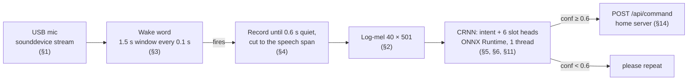

# Code guide: how the concepts are implemented

A study guide for reviewing the code. Each section names a concept (mel
spectrogram, CRNN, attention pooling, distillation, streaming wake word,
Raspberry Pi hardware, …), states what it does in this project, and links
to the exact lines that implement it. Read it top to bottom to follow one
command from the microphone to the action, or jump to a section from the
map below.

Everything here is the final system: the Experiment 43b intent + slot model
and the Experiment 43 wake word. Line links point at the current master;
if a file changes, the function names in each link still find the code.

## Map

| Concept | Where | Section |
|---|---|---|
| Sampling, resampling, microphone stream | `src/vcm/audio/`, `scripts/vcm_listen.py` | [1](#1-audio-in-microphone-to-16-khz-samples) |
| Log-mel spectrogram (STFT, mel filterbank, dB, normalization) | `src/vcm/audio/features.py`, `src/vcm/audio/dsp.py` | [2](#2-the-log-mel-spectrogram) |
| Streaming wake word ("Hey Kiwi") | `src/vcm/wakeword/` | [3](#3-the-wake-word-a-streaming-binary-classifier) |
| Endpointing: where a command starts and ends | `scripts/vcm_listen.py` | [4](#4-endpointing-recording-just-the-command) |
| CRNN: depthwise-separable convolutions, bidirectional GRU, attention pooling | `src/vcm/train/architectures.py` | [5](#5-the-crnn) |
| Intent classification, slot heads, reject threshold | `src/vcm/deploy/runtime.py`, `src/vcm/slots.py`, `src/vcm/dataset/sources/dataset_schema.py` | [6](#6-intent-classification-and-slot-values) |
| Dataset, speaker-disjoint validation split | `scripts/build_me2_manifest.py`, `src/vcm/train/dataset.py` | [7](#7-training-data) |
| Augmentation (waveform, SpecAugment) | `src/vcm/train/wave_augment.py`, `src/vcm/train/augment.py` | [8](#8-augmentation) |
| Loss: class weights, confusable-pair penalty, slot loss, knowledge distillation | `src/vcm/train/losses.py`, `src/vcm/train/train.py` | [9](#9-the-loss) |
| Optimizer, warm-up + cosine schedule, checkpoint selection | `src/vcm/train/train.py` | [10](#10-the-training-loop) |
| ONNX export and ONNX Runtime inference | `src/vcm/deploy/` | [11](#11-export-and-on-device-inference) |
| Evaluation and the Pi benchmark (p95, RTF) | `scripts/evaluate_checkpoint.py`, `scripts/benchmark_pi.py` | [12](#12-evaluation-and-benchmarking) |
| Raspberry Pi hardware: platform detection, GPIO, Sense HAT, audio devices, systemd | `src/vcm/hal/`, `src/vcm/config.py`, `deploy/` | [13](#13-raspberry-pi-hardware-and-services) |
| Home server: actions, ducking, timers, dashboard | `src/vcm/home/` | [14](#14-the-home-server-acting-on-the-command) |

## The path of one command



---

## 1. Audio in: microphone to 16 kHz samples

The models expect **16 kHz mono float32**. Some USB mics only record at 44.1
or 48 kHz, so the listener asks the device what it can do and resamples in
the stream callback.

| What | Code |
|---|---|
| The sample rate everything uses (16 kHz) | [`capture.py` L14](../src/vcm/audio/capture.py#L14) |
| Choose a rate the device supports | [`input_rate()` in resample.py L46-L55](../src/vcm/audio/resample.py#L46-L55) |
| Streaming resampler: a windowed-sinc low-pass FIR (anti-aliasing), then decimation, keeping filter state across chunks | [`lowpass_filter()` and `StreamResampler` L19-L44](../src/vcm/audio/resample.py#L19-L44) |
| The input stream: 100 ms chunks pushed to a queue from the audio callback | [`vcm_listen.py` L386-L400](../scripts/vcm_listen.py#L386-L400) |
| One BLAS thread, set before numpy loads (OpenBLAS otherwise busy-waits on all 4 Pi cores) | [`vcm_listen.py` L30-L34](../scripts/vcm_listen.py#L30-L34) |
| Refuse a speaker "monitor" as input, and exit if the default mic changes, so systemd restarts on the right one | [`guard_input()` L83-L108](../scripts/vcm_listen.py#L83-L108) |

**Review question:** why low-pass before decimating? Without it, energy
above the new Nyquist frequency (8 kHz) folds back into the band the model
hears (aliasing).

## 2. The log-mel spectrogram

The model never sees raw audio. Each clip becomes a 40 × 501 image: 40 mel
bands × 501 frames of 10 ms (5.0 s).

**Pipeline** in [`extract_log_mel()` L98-L120](../src/vcm/audio/features.py#L98-L120):

1. **Trim silence** (optional, on for the final model): drop leading and
   trailing audio more than 30 dB below the clip's peak, keeping a 0.1 s
   margin. [`trim_silence()` L52-L59](../src/vcm/audio/features.py#L52-L59)
   uses [`trim_bounds()` L76-L85](../src/vcm/audio/dsp.py#L76-L85), which
   computes frame energy in dB relative to the loudest frame.
2. **Fix the length** to 5.0 s, padding with zeros or cutting.
   [`_fix_length()` L91-L95](../src/vcm/audio/features.py#L91-L95)
3. **STFT power spectrum:** 400-sample (25 ms) Hann-windowed frames every
   160 samples (10 ms), FFT, squared magnitude.
   [`_frames()` L22-L27](../src/vcm/audio/dsp.py#L22-L27) (centered,
   zero-padded framing with `as_strided`, so no copy),
   [`_hann()` L57-L59](../src/vcm/audio/dsp.py#L57-L59),
   [`melspectrogram()` L62-L66](../src/vcm/audio/dsp.py#L62-L66).
   The constants are in [`features.py` L22-L24](../src/vcm/audio/features.py#L22-L24).
4. **Mel filterbank:** 40 triangular filters spaced evenly on the mel scale
   (Slaney: linear below 1 kHz, logarithmic above), each normalized by its
   bandwidth; the power spectrum is multiplied by this 40 × 201 matrix.
   [`_hz_to_mel()` / `_mel_to_hz()` L30-L40](../src/vcm/audio/dsp.py#L30-L40),
   [`mel_filters()` L43-L54](../src/vcm/audio/dsp.py#L43-L54).
5. **To decibels** relative to the clip's maximum, floored 80 dB below it.
   [`power_to_db_ref_max()` L69-L73](../src/vcm/audio/dsp.py#L69-L73)
6. **Standardize** with a fixed mean (−59.64) and standard deviation
   (21.30) measured once on training clips, so inputs are roughly zero-mean
   and unit-variance. [`features.py` L41-L42](../src/vcm/audio/features.py#L41-L42), applied at [L119](../src/vcm/audio/features.py#L119).

**Why numpy and not librosa:** `dsp.py` re-implements exactly the three
librosa functions used (checked against librosa by `tests/test_dsp.py`),
which keeps librosa, numba and scipy (~300 MB of memory) off the Pi. See
the [module docstring L1-L11](../src/vcm/audio/dsp.py#L1-L11).

**Why mel, why log:** the mel scale gives more resolution at low
frequencies, where speech formants are, and less at high frequencies, as
the ear does; the log compresses loudness, so a quiet and a loud "stop"
look alike. 40 bands × 10 ms is the standard keyword-spotting front end.

**The feature settings travel with the model.** The checkpoint records
`window_s` and `trim` ([`train.py` L345](../src/vcm/train/train.py#L345)),
the ONNX file stores them in its metadata, and the runtime passes them back
to `extract_log_mel` ([`runtime.py` L46, L58](../src/vcm/deploy/runtime.py#L41-L58)),
so training and the device can't drift apart.

**Also in features.py:** [`speech_level()` L66-L88](../src/vcm/audio/features.py#L66-L88),
the RMS of the loudest 300 ms. The endpointer (§4) uses it as its loudness
measure.

## 3. The wake word: a streaming binary classifier

"Hey Kiwi" is a separate, small CRNN (§5) with 2 outputs, `not_wake` and
`wake`: 32 channels, a 1-layer GRU of 32 units each way, 25,475
parameters. It scores the **last 1.5 s of audio every 0.1 s**.

| What | Code |
|---|---|
| Window, hop and labels | [`wakeword/__init__.py` L11-L14](../src/vcm/wakeword/__init__.py#L11-L14) |
| Ring buffer: shift in 0.1 s, compute the log-mel of the 1.5 s window, score it | [`WakeWordDetector.feed()` L81-L93](../src/vcm/wakeword/detector.py#L81-L93) |
| Fire only after 2 consecutive windows over the threshold, then ignore 2 s (one utterance fires once) | [`detector.py` L19-L24](../src/vcm/wakeword/detector.py#L19-L24), applied at [L90-L92](../src/vcm/wakeword/detector.py#L90-L92) |
| The same trigger rule offline, so false wake-ups per hour measured offline match the device | [`window_scores()` and `triggers()` L37-L61](../src/vcm/wakeword/detector.py#L37-L61) |
| Score with the ONNX model's `wake` probability | [`onnx_scorer()` L29-L34](../src/vcm/wakeword/detector.py#L29-L34) |
| Lower threshold (0.4) while music plays: the listener polls the home server every 2 s | [`follow_noise()` L271-L288](../scripts/vcm_listen.py#L271-L288) |

**Training data** ([`wakeword/data.py` L1-L35](../src/vcm/wakeword/data.py#L1-L35)):
five kinds of 1.5 s windows. `wake` is a synthetic or recorded "hey kiwi"
placed at a random offset. `partial` is the same clip cut off partway,
labeled 0, so the detector fires only once the whole phrase is in the
window. `hard` holds near-miss phrases ("hey kiki", "every week"). `speech`
and `noise` windows come from the class master dataset. Each batch is drawn
with a **weighted sampler**, so every kind gets a fixed share however many
clips it has
([`train_wakeword.py` L44](../scripts/train_wakeword.py#L44),
[L162-L174](../scripts/train_wakeword.py#L162-L174)).

## 4. Endpointing: recording just the command

After the wake word, the listener has to decide when the command has ended
without a button. It uses an **adaptive energy threshold with hysteresis**:

| What | Code |
|---|---|
| The constants: 0.6 s of quiet ends a command, 5 s maximum, speech = 3× the background to start and 1.5× to continue, 0.6 confidence to act | [`vcm_listen.py` L46-L54](../scripts/vcm_listen.py#L46-L54) |
| Background level from the 3 s before "Hey Kiwi" | [`background_floor()` L111-L115](../scripts/vcm_listen.py#L111-L115) |
| Record chunks until quiet; the floor follows the music down as it ducks | [`record_command()` L118-L148](../scripts/vcm_listen.py#L118-L148) |
| Keep only the first speech span, so music after a short "stop" isn't classified with it | [`first_speech_span()` L151-L186](../scripts/vcm_listen.py#L151-L186) |
| The main loop: wake → duck the music → chime → record → classify → restore | [`vcm_listen.py` L405-L437](../scripts/vcm_listen.py#L405-L437) |

**Why hysteresis:** a single bar either starts on music (too low) or cuts
off the soft end of "…to sixty percent" (too high). Two bars do both jobs.

## 5. The CRNN

**CRNN = convolutional recurrent neural network.** Convolutions find short
time–frequency patterns, and a recurrent layer reads them in order. The
class is [`CRNN` L86-L209](../src/vcm/train/architectures.py#L86-L209). The
final model's settings are `channels=80, rnn_hidden=96, rnn_layers=2,
pool_heads=4` with 6 slot heads; everything else is the default in
[`__init__` L116-L128](../src/vcm/train/architectures.py#L116-L128).

**Shapes through the final model**, for one 40 × 501 input
([`sequence_features()` L173-L182](../src/vcm/train/architectures.py#L173-L182)):

| Step | Code | Output shape | Params |
|---|---|---|---:|
| Add a channel axis | [L175](../src/vcm/train/architectures.py#L175) | 1 × 40 × 501 | |
| First conv, 10×4 kernel, stride 2, + BatchNorm + ReLU | [L143-L147](../src/vcm/train/architectures.py#L143-L147) | 80 × 20 × 250 | 3.4K |
| 4 depthwise-separable blocks; blocks 2 and 4 stride 2 | [L148-L150](../src/vcm/train/architectures.py#L148-L150) | 80 × 5 × 63 | 30K |
| Fold frequency into channels (80 × 5 = 400), 1×1 conv to 96 | [L151-L159](../src/vcm/train/architectures.py#L151-L159), [L179-L180](../src/vcm/train/architectures.py#L179-L180) | 96 × 63 | 39K |
| 2-layer bidirectional GRU | [L160-L163](../src/vcm/train/architectures.py#L160-L163), [L181](../src/vcm/train/architectures.py#L181) | 63 × 192 | 279K |
| 4-head attention pooling | [L164-L166](../src/vcm/train/architectures.py#L164-L166), [L191-L192](../src/vcm/train/architectures.py#L191-L192) | 768 | 772 |
| Dropout + linear classifier | [L167-L168](../src/vcm/train/architectures.py#L167-L168), [L193](../src/vcm/train/architectures.py#L193) | 20 logits | 15K |
| 6 slot heads, each with its own 1-head attention + linear | [L169-L171](../src/vcm/train/architectures.py#L169-L171), [L199-L205](../src/vcm/train/architectures.py#L199-L205) | 3 logits each | 4.6K |

Total: 372,096 parameters. The full diagram is in [MODEL.md §3](MODEL.md#3-architecture-crnn).

**The building blocks:**

- **Depthwise-separable convolution**
  ([`DepthwiseSeparableBlock` L14-L33](../src/vcm/train/architectures.py#L14-L33)).
  A 3×3 convolution per channel (`groups=in_channels`) then a 1×1
  convolution that mixes channels. For 80 channels that is 80·9 + 80·80 ≈
  7.1K weights against 80·80·9 = 57.6K for a normal 3×3 convolution, about
  8× fewer (MobileNet's idea).
- **Strides widen the receptive field.** Blocks 2 and 4 stride by 2
  ([L149](../src/vcm/train/architectures.py#L149)), so each later step sees
  a geometrically larger stretch of audio. After the stack, one time step
  is ~80 ms.
- **Bidirectional GRU** ([L160-L163](../src/vcm/train/architectures.py#L160-L163)).
  A GRU is a recurrent unit with update and reset gates that decide how
  much of the past to keep. One direction reads start → end, the other end
  → start; their outputs are concatenated (96 + 96 = 192), so each step
  carries context from the whole command. This is why "volume up" and
  "volume down" separate: word order is modeled. It also makes the model
  **non-causal**: it classifies once the command has ended. The wake word
  handles streaming.
- **Attention pooling** ([L191-L192](../src/vcm/train/architectures.py#L191-L192)).
  A linear layer scores each of the 63 steps once per head; a softmax over
  time turns the scores into weights that sum to 1; each head returns the
  weighted average of the steps (`einsum("bth,btd->bhd")`), and the 4 heads
  are concatenated. The frame that says "up" can dominate instead of being
  averaged away. This is a single learned scorer per head, not
  Transformer self-attention.
- **Multi-task slot heads** ([L199-L209](../src/vcm/train/architectures.py#L199-L209)).
  They share the encoder output with the intent head but have their own
  attention, so the TIMER head can look at "thirty seconds" while the intent
  head looks at "timer".

The same file holds the two **baselines** the CRNN is compared against:
[`DSCNN` L36-L83](../src/vcm/train/architectures.py#L36-L83) (convolutions,
then global average pooling: no word order) and
[`BCResBlock` and `BCResNet` L212-L293](../src/vcm/train/architectures.py#L212-L293).
Compare `DSCNN.forward` ([L75-L83](../src/vcm/train/architectures.py#L75-L83))
with `CRNN.forward_with_sequence` ([L184-L193](../src/vcm/train/architectures.py#L184-L193))
to see the difference in one place.

## 6. Intent classification and slot values

**The label set** is the class schema: 13 fixed intents, 6 slotted ones,
plus `OUT_OF_SCOPE`.

| What | Code |
|---|---|
| The 19 intents and their phrasings (Option B) | [`FIXED_INTENTS` and `SLOTTED_INTENTS`, dataset_schema.py L35-L94](../src/vcm/dataset/sources/dataset_schema.py#L35-L94) |
| The non-command class, never acted on | [L96-L100](../src/vcm/dataset/sources/dataset_schema.py#L96-L100) |
| The slot vocabularies: 3 values per slotted intent; the head order is the dict order | [`SLOT_VOCAB` slots.py L41-L69](../src/vcm/slots.py#L41-L69) |
| Training target per clip: its intent's head gets the value's index, the other 5 heads −1 (ignored) | [`slot_target()` L243-L246](../src/vcm/slots.py#L243-L246) |

**Slot filling as classification:** instead of tagging a span of a
transcript (there is no transcript), each slotted intent has a 3-way
classifier over its fixed values. A value is read only from the head that
matches the predicted intent.

**On the device** ([`OnnxIntentModel.predict_audio()` L57-L68](../src/vcm/deploy/runtime.py#L57-L68)):
features → softmax over 20 intents → argmax → if the intent has a slot
head, argmax over its 3 values.

**The reject rule** (two ways to decline):

1. Confidence below 0.6 → "didn't catch that, please repeat"
   ([`report()` L318-L333](../scripts/vcm_listen.py#L318-L333)).
2. The intent is `OUT_OF_SCOPE` → no action
   ([`Dispatcher.handle()` L77-L89](../src/vcm/home/dispatcher.py#L77-L89)).

[`result_line()` L301-L315](../scripts/vcm_listen.py#L301-L315) prints one
JSON line per command with what the device did (the format the class
benchmark parses).

## 7. Training data

| What | Code |
|---|---|
| Read the class master dataset (download or the DGX's shared copy) and write audio + `manifest.csv` | [`build_me2_manifest.py` `main()` from L144](../scripts/build_me2_manifest.py#L144-L200) |
| **Speaker-disjoint validation split:** whole speakers (per source) moved from train to val until ~12% of each source's clips | [`choose_val_speakers()` L121-L141](../scripts/build_me2_manifest.py#L121-L141), applied at [L183-L195](../scripts/build_me2_manifest.py#L183-L195) |
| The manifest row format (`audio_path, label, source, is_synthetic, speaker_id, split`) | [`src/vcm/dataset/manifest.py`](../src/vcm/dataset/manifest.py) |
| Add the supplemental synthetic clips of train voices | [`train.py` L369-L374](../src/vcm/train/train.py#L369-L374) |
| Add 1,500 bare numbers as `OUT_OF_SCOPE` examples | [`train.py` L375-L380](../src/vcm/train/train.py#L375-L380) |
| Dataset item: read → (trim → waveform augment) → log-mel → SpecAugment → (features, label, teacher probs, slot targets) | [`ManifestDataset.__getitem__()` L152-L186](../src/vcm/train/dataset.py#L152-L186) |

**Why speaker-disjoint:** if a voice is in both train and val, val
measures memorized voices. With whole speakers held out, val estimates
accuracy on new people, which is what the test set and the Pi see.

## 8. Augmentation

**Waveform augmentation** ([`augment_waveform()` L76-L85](../src/vcm/train/wave_augment.py#L76-L85),
probabilities and ranges at [L26-L32](../src/vcm/train/wave_augment.py#L26-L32)):
speed 0.9–1.1×, room reverb, background noise at 5–25 dB SNR, and a 0–0.3 s
start shift. Noise comes only from train-split clips
([`load_noise_bank()` L101-L114](../src/vcm/train/dataset.py#L101-L114)).
In the dataset, trimming happens *before* augmenting
([L156-L163](../src/vcm/train/dataset.py#L156-L163)) so the trim doesn't
undo the random shift.

**SpecAugment** ([`spec_augment()` L19-L47](../src/vcm/train/augment.py#L19-L47)):
masks random bands of the log-mel with the clip's mean. The final model
uses **frequency masks only**
([`train.py` L355-L356](../src/vcm/train/train.py#L355-L356)): a time mask
can erase the one word that decides the class ("up").

## 9. The loss

```
L = CE_w(intent) + α · p(confusable classes) + 0.3 · mean CE(slot heads) + T² · KL(teacher_T ‖ student_T)
```

| Term | Code |
|---|---|
| **Class-weighted cross-entropy**: weight = N / (classes × count), so rare classes such as OUT_OF_SCOPE count as much as common ones | [`class_weights()` dataset.py L216-L224](../src/vcm/train/dataset.py#L216-L224), used at [`train.py` L440](../src/vcm/train/train.py#L440) |
| **Confusable-pair penalty** (α = 2.0): add the probability the model puts on classes known to be confused with the true one | groups at [losses.py L48-L51](../src/vcm/train/losses.py#L48-L51), mask at [L80-L95](../src/vcm/train/losses.py#L80-L95), loss at [`ConfusablePairLoss.forward()` L136-L149](../src/vcm/train/losses.py#L136-L149) |
| **Slot cross-entropy** (weight 0.3), `ignore_index=-1` for heads that don't apply | [`train.py` L572-L580](../src/vcm/train/train.py#L572-L580) |
| **Knowledge distillation** (Hinton et al. 2015): KL divergence between the student's and the teacher's temperature-softened distributions, scaled by T² (T = 3) | [`DistillationLoss.forward()` L186-L200](../src/vcm/train/losses.py#L186-L200), wired up at [`train.py` L459-L465](../src/vcm/train/train.py#L459-L465) |

**The teacher** is the average of 9 smaller CRNNs' softmax outputs,
computed once and written to a CSV
([`generate_ensemble_labels.py` L52-L74](../scripts/generate_ensemble_labels.py#L52-L74)).
Because those probabilities are near one-hot on training clips, they are
softened with the temperature too (`soften_teacher`,
[losses.py L194-L195](../src/vcm/train/losses.py#L194-L195)). **Why T²:**
softening divides the logits' gradients by T², so multiplying the KL by T²
keeps its scale comparable to the cross-entropy term.

## 10. The training loop

| What | Code |
|---|---|
| Build the model from the CLI flags (`--width 80 --rnn-hidden 96 --rnn-layers 2 --pool-heads 4`, slot heads) | [`train.py` L467-L485](../src/vcm/train/train.py#L467-L485) |
| **Adam**, lr 1e-3 | [L519](../src/vcm/train/train.py#L519) |
| **5-epoch linear warm-up, then cosine decay** to 0 | [L527-L537](../src/vcm/train/train.py#L527-L537) |
| One epoch: forward with the sequence features, loss, backward, step | [L542-L591](../src/vcm/train/train.py#L542-L591) |
| **Checkpoint selection on validation accuracy** (never test); the checkpoint stores weights, model settings, feature config, labels and slot vocabulary | [L609-L653](../src/vcm/train/train.py#L609-L653) |
| The exact final command, and 3 seeds | [TRAINING.md](TRAINING.md#reproducing-the-final-model), [`results/launchers/run_queue_exp43.sh`](../results/launchers/run_queue_exp43.sh) |

`train.py` has other flags (CTC, EMA, focal loss, frozen encoder,
resume). They were tested in experiments and are off in the final recipe;
the flags it uses are in [TRAINING.md](TRAINING.md#reproducing-the-final-model).

## 11. Export and on-device inference

| What | Code |
|---|---|
| Wrap the model so the ONNX graph outputs **probabilities** (softmax) for the intent and every slot head | [`_ProbsWrapper` export.py L22-L32](../src/vcm/deploy/export.py#L22-L32) |
| Export to ONNX opset 17 with a variable batch axis | [L51-L64](../src/vcm/deploy/export.py#L51-L64) |
| Store labels, feature config, slot vocabulary and source checkpoint **in the ONNX metadata** | [L66-L81](../src/vcm/deploy/export.py#L66-L81) |
| ONNX Runtime session: CPU, **1 intra-op and 1 inter-op thread** | [`_session()` runtime.py L18-L26](../src/vcm/deploy/runtime.py#L18-L26) |
| Read the metadata back, so the device needs no separate config | [`OnnxIntentModel.__init__` L42-L48](../src/vcm/deploy/runtime.py#L42-L48) |

**Why fp32:** dynamic int8 quantization (`quantize_int8()`,
[export.py from L84](../src/vcm/deploy/export.py#L84)) cost accuracy and
was no faster on the Pi's CPU for a model this small. **Why one thread:**
the model is ~10 ms; thread start-up and synchronization would cost more
than they save, and the wake word needs a core of its own.

## 12. Evaluation and benchmarking

| What | Code |
|---|---|
| **Real speech** = not synthetic and not a non-command clip | [`evaluate_checkpoint.py` L187](../scripts/evaluate_checkpoint.py#L187) |
| Overall, real-speech, macro and per-class accuracy | [L194-L228](../scripts/evaluate_checkpoint.py#L194-L228) |
| Reject-threshold table: what each confidence threshold would reject, and the accuracy of what remains | [`print_confidence_table()` L116-L135](../scripts/evaluate_checkpoint.py#L116-L135) |
| Slot accuracy (slot only, and slot + intent) | [`print_slot_accuracy()` from L92](../scripts/evaluate_checkpoint.py#L92-L113) |
| **Pi benchmark:** feature and model time, end-to-end time per command, **p50/p95**, **real-time factor** (processing time ÷ audio duration), the wake word's share of one core, peak memory | [`benchmark_pi.py` L86-L102](../scripts/benchmark_pi.py#L86-L102), printed at [L103-L126](../scripts/benchmark_pi.py#L103-L126) |

**Why p95, not the mean:** a user notices the slow commands; p95 bounds
the delay 19 commands in 20 stay under.

## 13. Raspberry Pi hardware and services

The same code runs on a Mac and on the Pi. Hardware sits behind small
interfaces, and the implementation is chosen at start-up.

| What | Code |
|---|---|
| **Platform detection:** env var → settings → `/proc/device-tree/model` says "Raspberry Pi" | [`get_platform()` config.py L39-L78](../src/vcm/config.py#L39-L78) |
| **Push-to-talk button:** GPIO 17 with an internal pull-up (gpiozero) on the Pi, the spacebar on a Mac | [`hal/button.py` L74-L100](../src/vcm/hal/button.py#L74-L100) |
| **Sense HAT temperature**, corrected for the CPU's heat below it: room = raw − (cpu − raw) / factor | [`hal/temperature.py` L23-L63](../src/vcm/hal/temperature.py#L23-L63) |
| **Audio device rules (WirePlumber):** any USB mic is the input, the soundbar's own mic is disabled, the soundbar is the output, no saved stream volumes | [`deploy/wireplumber/51-kiwi-audio.lua`](../deploy/wireplumber/51-kiwi-audio.lua#L13-L33) |
| **systemd user services:** home server and listener, restart 3 s after any exit, start at boot | [`deploy/systemd/vcm-home.service`](../deploy/systemd/vcm-home.service), [`deploy/systemd/vcm.service`](../deploy/systemd/vcm.service) |
| **Deploy over SSH:** check 64-bit, apt packages, rsync code + models, venv with only `requirements-pi.txt`, Sense HAT link, benchmark, audio rules, services | [`scripts/deploy_pi.sh`](../scripts/deploy_pi.sh) |
| **Preflight check:** power and throttling, mic and speaker, services, listener capturing, models, internet | [`kiwi_doctor.py` `check_*` functions L49-L174](../scripts/kiwi_doctor.py#L49-L174) |
| The only packages the Pi installs | [`requirements-pi.txt`](../requirements-pi.txt) |

## 14. The home server: acting on the command

A standard-library HTTP server with one static dashboard page, updated live
over server-sent events.

| What | Code |
|---|---|
| `POST /api/command`: check the intent, run it, speak the reply | [`server.py` L165-L176](../src/vcm/home/server.py#L165-L176) |
| `POST /api/duck` (the listener lowers music while you speak) and `GET /api/noisy` (is music playing?) | [L177-L182](../src/vcm/home/server.py#L177-L182), [L133](../src/vcm/home/server.py#L133) |
| Intent → handler table | [`Dispatcher.__init__` L61-L75](../src/vcm/home/dispatcher.py#L61-L75) |
| Ducking: lower every other audio stream (PipeWire) and Spotify's volume, undo after 20 s if never ended | [`Dispatcher.duck()` from L157](../src/vcm/home/dispatcher.py#L157-L190) |
| Timers and alarms fire from a scheduler thread; the thermostat is simulated | [`Scheduler.tick()` L62-L86](../src/vcm/home/scheduler.py#L62-L86) |

## Self-check questions

1. What is the shape of the input to the CRNN, and which three numbers in
   `features.py` determine it?
2. Why does the GRU make the model non-causal, and what part of the
   system handles streaming instead?
3. How many parameters does one attention-pooling head have, and why is it
   not "self-attention"?
4. Where would a train/device feature mismatch come from, and what stops
   it? (Hint: `feature_config` in the checkpoint and the ONNX metadata.)
5. What are the two separate ways the device declines to act on a command?
6. Why is the validation split carved by speaker, and why are settings
   chosen on val and not on test?
7. What does multiplying the distillation KL by T² correct for?
8. Why does the wake word need `partial` negatives?
9. What happens, step by step, when the USB mic is unplugged and plugged
   back in while the services run?
10. Why one ONNX Runtime thread on a 4-core Pi?
