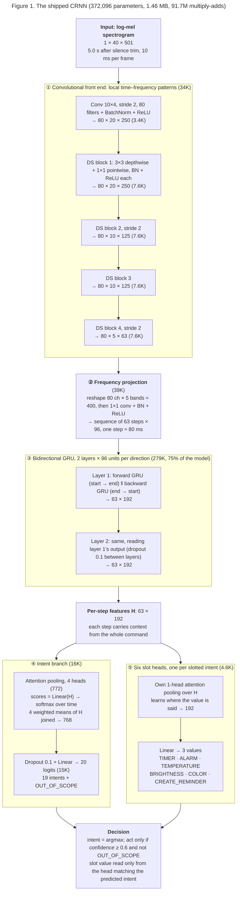
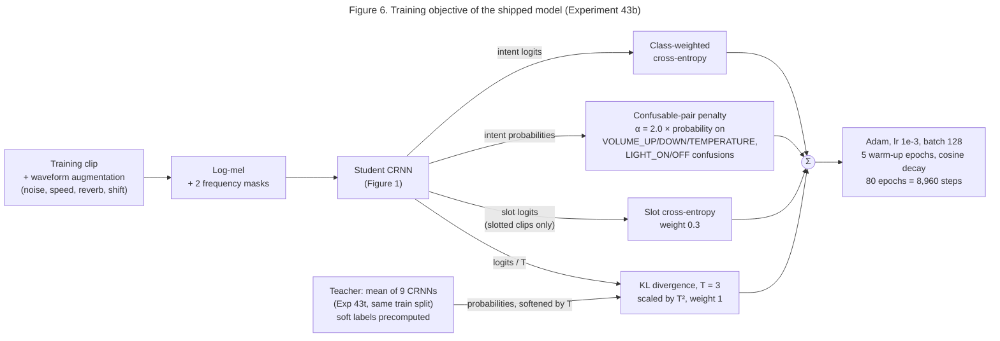
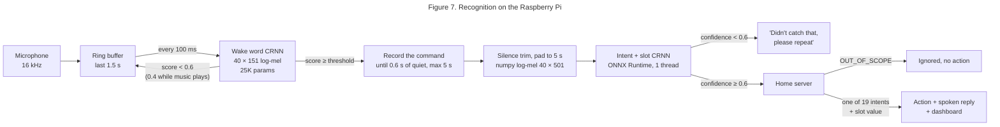

# The models

Two small models run on the device. Both are CRNNs over log-mel features,
exported to fp32 ONNX and run with ONNX Runtime (no PyTorch on the device).

| | Intent + slot model | "Hey Kiwi" wake word |
|---|---|---|
| File | `models/vcm_intent.onnx` | `models/kiwi_wakeword.onnx` |
| Size | 1.46 MB (1,463 KB) fp32; `vcm_intent_small.onnx` 722 KB | 107 KB |
| Parameters | 372,096 | 25,475 |
| Compute | 91.7M multiply-adds per command (74M convolutions, 18M GRU and heads) | 5.3M multiply-adds per window, 10 windows a second |
| Input | 40 log-mel bands × 501 frames (5.0 s, silence-trimmed) | 40 × 151 frames (1.5 s window) |
| Output | 20 classes (19 intents + `OUT_OF_SCOPE`) and 6 slot-value heads, 3 values each | wake / not wake |
| When it runs | Once per command, after the wake word | Every 100 ms, always on |
| Source checkpoint | `exp43b_supplemental_s1.pt` (Experiment 43b, seed 1; also `models/vcm_intent.pt`) | `exp43w_wake_s1.pt` (Experiment 43, seed 1; also `models/kiwi_wakeword.pt`) |
| Headline result | **95.50%** on the class test set (n=4,443, revision `da92a79`), 78.64% on its real speech, 96.04% on the Pi holdout set | 3.8% missed (7.2% in noise), 0/10 of the author's real takes missed, 12.9 false wake-ups/hour, at threshold 0.6 |

The label list, slot vocabulary and feature settings are stored in each ONNX
file's metadata, so the runtime reads them from the model instead of keeping
its own copy.

## 1. The task

This is **closed-set spoken intent classification**, not speech recognition:
audio in, one of 20 labels out, never a transcript. The assignment rules out
ASR on the device because of its footprint, and a closed-set classifier is
orders of magnitude smaller.

Six intents also carry a value, predicted by a classification head over a
fixed vocabulary (`vcm/slots.py`). Each vocabulary is exactly the class
schema's 3 values:

| Intent | Values |
|---|---|
| TIMER | 10 seconds / 30 seconds / 1 minute |
| ALARM | 6:00 AM / 8:00 AM / 9:00 PM |
| TEMPERATURE | 18 / 22 / 26 degrees |
| BRIGHTNESS | 20 / 60 / 100 percent |
| COLOR | red / blue / green |
| CREATE_REMINDER | drink water / study / exercise |

The 20th class, `OUT_OF_SCOPE`, is mostly speech that is not a command
(plus noise); the device never acts on it.

## 2. Features

`vcm/audio/features.py`: 16 kHz mono audio, silence trimmed (30 dB below
peak, 0.1 s margin), padded or cut to 5.0 s, then a 40-band log-mel
spectrogram (400-sample FFT, 160-sample hop = 10 ms frames), converted to dB
and normalized with a fixed mean and standard deviation measured on 2,000
training clips.

On the device the same features come from `vcm/audio/dsp.py`, a numpy
re-implementation of librosa's mel spectrogram, tested to match it. That
removed librosa, scipy and numba from the device and cut peak memory from
~330 MB to ~100 MB.

## 3. Architecture: CRNN

`vcm/train/architectures.py`, class `CRNN`. A CRNN is a convolutional
recurrent neural network. The convolutions find short sound patterns. The
recurrent layer (a GRU) reads those patterns in order, like reading words in
a sentence.

### 3.1 The diagram

**Figure 1. The shipped CRNN: from a spectrogram to an intent and a slot value.**
The model turns 5 seconds of audio into a picture of sound energy over time.
Convolutions find short sound patterns in that picture. A GRU then reads the
patterns in order, from start to end and from end to start. Attention pooling
picks the moments that matter, and the classifiers name the intent and its
value.

Shapes are written as channels × mel bands × time frames. One time frame is
10 ms at the input. Parameter counts are in brackets.

Total: **372,096 parameters**, 1.46 MB as fp32 ONNX, 91.7M multiply-adds per
command. Three quarters of the parameters are in the GRU.

### 3.2 Walking through it

1. **Convolutional front end.** The first convolution looks at 10 mel bands
   × 4 frames at a time and halves both axes. Then four depthwise-separable
   blocks follow. A depthwise-separable block splits a normal convolution in
   two: a 3×3 filter per channel, then a 1×1 filter that mixes channels.
   This uses about 8 times fewer parameters than a normal 3×3 convolution.
   Blocks 2 and 4 halve the map again, so the later blocks see a wider
   stretch of audio.
2. **Frequency projection.** The map is now 80 channels × 5 bands × 63
   steps. A 1×1 convolution turns each time step into one vector of 96
   numbers. The audio is now a sequence, one step per ~80 ms.
3. **Bidirectional GRU, 2 layers.** One GRU reads the 63 steps from start
   to end, and another reads them from end to start. Their outputs are
   joined, so every step carries context from the whole command. A second
   layer reads the first layer's output the same way. This is what lets
   the model tell "turn the volume up" from "turn the volume down". The
   second layer was the best single change in the ablations (+1.5 points
   of real speech on val).
4. **Attention pooling, 4 heads.** A linear layer gives every step 4
   scores. Softmax over time turns each head's scores into weights that add
   up to 1, and each head's weighted average is a summary of the command.
   The 4 summaries are joined. The step that says "up" can get a high
   weight and decide the answer; different heads can attend to different
   words.
5. **Slot heads.** Each slotted intent has its own attention pooling and
   classifier. The value ("five minutes", "blue") is usually in a different
   part of the command than the words that identify the intent, so each slot
   head learns where to look. A slot value is only used when the intent
   matches, for example the TIMER head only when the intent is TIMER.

**The wake word** uses the same design at a smaller size: 32 channels, 32
GRU units each way, and a 1.5 s input (40 × 151 frames, which becomes 19
steps). It has 25,475 parameters (107 KB as fp32 ONNX, 5.3M multiply-adds
per window) and 2 outputs: "hey kiwi" or not.

### 3.3 Why a CRNN

Standard keyword-spotting models (DS-CNN, BC-ResNet) look at short windows
of about a quarter of a second and then average over the whole clip, so
word order is lost. That is fine for single keywords but not for commands
that differ by one word, like "volume up" and "volume down", or "lights
on" and "lights off". The CRNN keeps the order: strided convolutions widen
what each step sees, the bidirectional GRU reads the whole command, and
attention pooling lets the deciding word dominate the summary. At the same
size, on the same data, it beats both by 3–11 points overall and 13–28
points on real speech (section 4).

**Assignment note.** The original plan said "no attention/transformer
layers". Attention pooling here is one linear scorer over time steps (193
parameters per head). A Transformer's self-attention compares every step
with every other step and is much larger. We measured the fallback: with
plain average pooling instead, real-speech accuracy drops 5.6 points on
val and 5.2 on test, so attention pooling stays.

## 4. Baselines

The checklist asks for a baseline of comparable size. DS-CNN ("Hello Edge",
Zhang et al. 2017) and BC-ResNet (Kim et al. 2021) were scaled to about
100K parameters and trained with the same data and recipe as a CRNN of the
same size (80 epochs, waveform augmentation, confusable-pair loss; mean of
3 seeds). They were trained on the dataset's first revision; none of the
current test clips were in that train split, so all four rows are scored
fairly on the current test set:

| | DS-CNN 128×5 | BC-ResNet 112×6 | CRNN, same size | **CRNN, final (43b)** |
|---|---:|---:|---:|---:|
| Parameters | 99,604 | 89,396 | 99,373 | **372,096** |
| Test, all | 89.50% | 81.29% | 92.41% | **95.27%** |
| Test, real speech | 57.06% | 41.57% | 69.71% | **77.57%** |

The full-resolution baselines also need 7–12 GB of GPU memory each against
the CRNN's ~2.5 GB, because the CRNN's strided blocks shrink the map early.
The final CRNN's extra parameters (wider, a second GRU layer, four
attention heads) and its distillation recipe add the remaining 8 points of
real speech. Every intermediate model, and the earlier architectures with
their diagrams, are in [EXPERIMENTS.md](EXPERIMENTS.md#part-0-from-the-first-model-to-the-final-one).

## 5. Training recipe (final model)

**Figure 6. The training objective.** One forward pass of the student
feeds four loss terms. The teacher is an ensemble of 9 smaller CRNNs
(99K parameters: 64 channels, one GRU layer, one attention head; three
recipes × three seeds, Experiment 43t) trained on the same train split.
The ensemble scores 95.0% on val against 93.2% for one of its members on
average. Its averaged predictions are computed once, before training, and
stored as soft labels; it is not used on the device. Only the student
(the shipped CRNN) is exported.

Full commands are in [TRAINING.md](TRAINING.md#reproducing-the-final-model);
results for every run are in [EXPERIMENTS.md](EXPERIMENTS.md). Every choice
below was made on our validation split, never on test.

| Setting | Value | Why |
|---|---|---|
| Data | Class master dataset, revision `da92a79`: 9,285 train clips (22% real) + 3,461 supplemental synthetic clips of train voices + 1,500 numerals clips as OUT_OF_SCOPE = 14,246 ([DATASET.md](DATASET.md)) | The class's agreed data; bare numbers are a cheap source of "not a command"; the supplemental clips add 2.1 points of real speech on val |
| Epochs, batch, optimizer | 80 epochs (8,960 steps), batch 128, Adam lr 1e-3, 5 warm-up epochs then cosine decay | 150 epochs didn't help |
| Loss | Class-weighted cross-entropy + confusable-pair penalty (alpha 2.0) on VOLUME_UP/DOWN/TEMPERATURE and LIGHT_ON/OFF | Class weights keep OUT_OF_SCOPE from being ignored; the penalty targets the one-word confusions |
| Slot loss | Cross-entropy per slot head, weight 0.3, on clips with a schema slot value | Joint training gave clearly better slot values than training slot heads on a frozen encoder (83% vs 78% mean) |
| Distillation | KL toward the averaged predictions of the 43t ensemble, temperature 3 on both sides, weight 1 | Passes most of the ensemble's advantage (95.0% vs 93.2% on val) to one model |
| Waveform augmentation | Background noise at 5–25 dB SNR, speed 0.9–1.1×, room reverb, 0–0.3 s start shift | Real speech is noisier and more varied than the synthetic voices |
| SpecAugment | 2 frequency masks (up to 8 bands), no time masks | Time masks can erase the one word that matters |
| Architecture | 80 channels, 2-layer GRU of 96, 4 attention heads | Each helped on val; mean pooling instead of attention costs 5.6 points of real speech |
| Features | Silence trim + 5.0 s window | Training clips then look like live recordings, which start right after the wake word |
| Checkpoint selection | Best validation accuracy | Val is speaker-disjoint from train and test |
| Seeds | 3; shipped seed 1, the best on val | Seeds differ by up to 2 points on real speech |
| Tried and dropped | EMA of weights (−3.6 real on val), numerals as background talk (−2.5), label smoothing, wider speed range, more epochs, repeating real clips | [EXPERIMENTS.md](EXPERIMENTS.md) |

## 6. The wake word

"Hey Kiwi" was picked before any model was built, by scoring 11 candidates
for false-trigger risk against 62,836 command transcripts and common English
words (EXPERIMENTS.md, "Wake-word selection"). The detector is the same CRNN
design at a quarter of the size (32 channels, 32 GRU units each way),
trained on 1.5 s windows:
~3,000 synthetic "hey kiwi" clips in 145 cloned voices, the author's own 20
training takes, near-miss phrases ("hey kitty", "every week") as hard
negatives, and ordinary speech and noise from the class master dataset
(its train split, including out-of-scope speech, plus 3,000 numerals
clips). The "hey kiwi" positives can't come from the class dataset, which
has none.

`vcm/wakeword/detector.py` scores the last 1.5 s every 100 ms. When the score
passes the threshold, `scripts/vcm_listen.py` records until 0.6 s of quiet
(max 5 s) and passes the command to the intent model.

**Figure 7. The two-stage pipeline on the device.** The wake word runs
on every 100 ms hop; the intent model runs once per command. The
confidence threshold and the OUT_OF_SCOPE class are two separate ways the
device declines to act.

| Threshold | Missed, clean | Missed, 10 dB noise | Author's real takes missed | False wake-ups per hour* |
|---:|---:|---:|---:|---:|
| **0.6 (default)** | 3.8% | 7.2% | 0/10 | 12.9 |
| 0.7 | 4.6% | 8.4% | 0/10 | 9.5 |
| 0.85 | 8.2% | 12.5% | 0/10 | 7.2 |
| 0.95 | 13.8% | 23.3% | 0/10 | 2.0 |

\*Streaming the master dataset's test split (4,443 clips) and 300 near-miss
phrases back to back, 2.94 h, so a real room sees fewer. The offline
choice was 0.95; live testing on the Pi
showed it missed too many real attempts from across the room, so the
default is 0.6, and 0.4 while music is playing.

## 7. Export and runtime

- `scripts/export_onnx.py` exports a checkpoint to ONNX (opset 17) and writes
  the labels, slot vocabulary and feature settings into its metadata. The
  exported file was checked against the PyTorch checkpoint on the full test
  split: identical real-speech accuracy and slot lines.
- `vcm/deploy/runtime.py` (`OnnxIntentModel`) runs it with ONNX Runtime, one
  thread.
- **fp32, not int8.** Dynamic int8 quantization cost 6.8 points of
  real-speech accuracy when we tested it on an earlier, smaller CRNN, and
  was no faster on the CPU.
- **Size.** With the wake word, the shipped files total 1.57 MB, over a
  1 MB budget. `models/vcm_intent_small.onnx` (Experiment 43c seed 0, the
  same recipe at 64 channels and GRU 64 without the supplemental clips:
  182K parameters, 722 KB, 94.53% test / 76.06% real speech) keeps both
  under 1 MB, at a cost of 1 point overall and 2.6 on real speech.
- Commands below 0.6 confidence get "didn't catch that, please repeat"
  instead of an action. On real-speech test clips this rejects 15.7% of
  commands and the model is right on 86.6% of the ones it accepts
  (against 78.6% over all of them).

Measured cost on the Raspberry Pi 5 (`scripts/benchmark_pi.py`, 1 thread,
both services running, shipped Experiment 43b weights): **13.9 ms p50 /
15.2 ms p95 per command** end to end (3.8 ms features + 10.1 ms model),
RTF 0.0061 at p95; the wake word takes 2.0 ms per 100 ms hop at p95, 1.9%
of one core; 99 MB peak memory. The small model takes about 12 ms p95
(7.2 ms model; timed with earlier weights of the same architecture).
Details in
[results/bench_pi5.md](../results/bench_pi5.md) and
[FOOTPRINT.md](FOOTPRINT.md).

## 8. Alternative considered: ASR cascade

Commercial assistants (Alexa, Siri, Google Assistant) transcribe speech
first and classify the text. We built that too, on the project's earlier
dataset: faster-whisper `base` transcribes the audio, and a TF-IDF +
logistic regression classifier maps the transcript to an intent. Text
makes one-word differences trivial, so it was more accurate than the CRNN
of the time.

It was not shipped, for the assignment's reason: footprint. Whisper `base`
alone is ~145 MB (about 90× both our model files), needs 5–7× the memory,
takes 440–950 ms per command on a laptop against 15 ms for our model on
the Pi, and is far too slow to listen continuously, so it would still need
a separate wake-word model. The full comparison is in
[FOOTPRINT.md](FOOTPRINT.md#part-2-our-pipeline-vs-an-asr-cascade), and the
accuracy comparison (on the earlier dataset) in
[EXPERIMENTS.md](EXPERIMENTS.md#asr-cascade-experiment-26).

Published results put our number in context: SLURP, the dataset closest to
ours, tops out at 87–88% intent accuracy even with large pretrained speech
encoders (Bastianelli et al. 2020). Benchmarks that reach 95%+ (Speech
Commands, Fluent Speech Commands) use single words or a few hundred scripted
phrases.

## References

- Zhang, Suda, Lai, Chandra. "Hello Edge: Keyword Spotting on Microcontrollers." 2017. https://arxiv.org/abs/1711.07128 (DS-CNN)
- Kim, Chang, Lee, Sung. "Broadcasted Residual Learning for Efficient Keyword Spotting." Interspeech 2021. https://arxiv.org/abs/2106.04140 (BC-ResNet)
- Choi et al. "Temporal Convolution for Real-time Keyword Spotting on Mobile Devices." 2019. https://arxiv.org/abs/1904.03814 (TC-ResNet)
- Howard et al. "MobileNets." 2017. https://arxiv.org/abs/1704.04861 (depthwise-separable convolutions)
- Park et al. "SpecAugment." 2019. https://arxiv.org/abs/1904.08779
- Lin, Goyal, Girshick, He, Dollár. "Focal Loss for Dense Object Detection." ICCV 2017. https://arxiv.org/abs/1708.02002
- Lugosch et al. "Speech Model Pre-training for End-to-End Spoken Language Understanding." Interspeech 2019. https://arxiv.org/abs/1904.03670 (an auxiliary CTC loss we tried and dropped)
- Hinton, Vinyals, Dean. "Distilling the Knowledge in a Neural Network." 2015. https://arxiv.org/abs/1503.02531 (the distillation term)
- Krishnamoorthi. "Quantizing deep convolutional networks for efficient inference: A whitepaper." 2018. https://arxiv.org/abs/1806.08342
- Warden. "Speech Commands: A Dataset for Limited-Vocabulary Speech Recognition." 2018. https://arxiv.org/abs/1804.03209
- Bastianelli, Vanzo, Swietojanski, Rieser. "SLURP: A Spoken Language Understanding Resource Package." EMNLP 2020. https://aclanthology.org/2020.emnlp-main.588
- Lugosch et al. "Timers and Such: A Practical Benchmark for Spoken Language Understanding with Numbers." NeurIPS 2021 Datasets and Benchmarks. https://arxiv.org/abs/2104.01604
- Kumar et al. "FANS: Fusing ASR and NLU for Spoken Language Understanding." Interspeech 2021. https://arxiv.org/abs/2111.00400 (Alexa's ASR → NLU production design)
