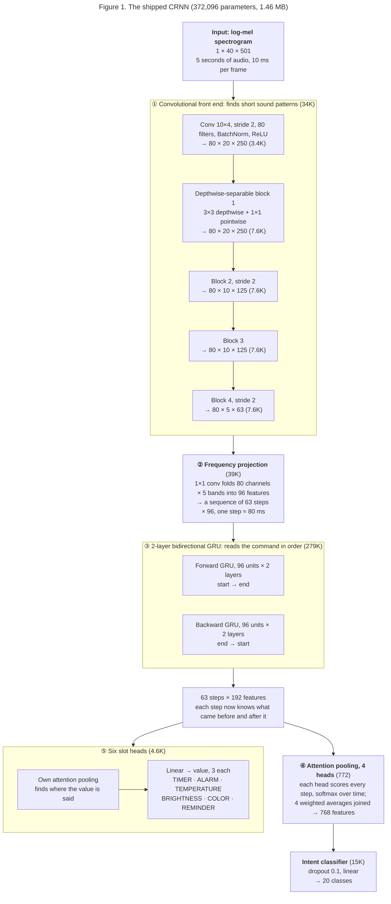
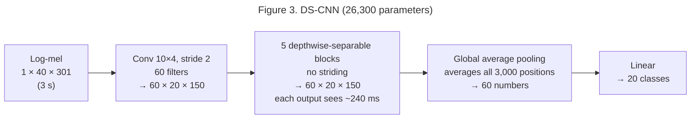
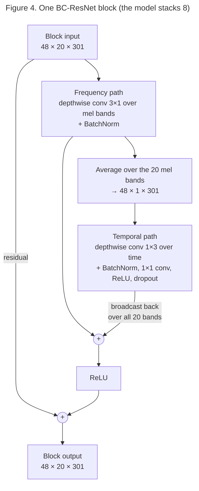
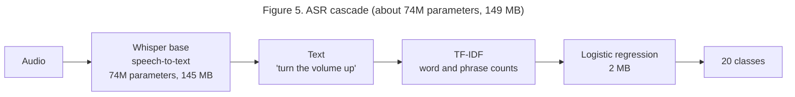

# The models

Two small models run on the device. Both are CRNNs over log-mel features,
exported to fp32 ONNX and run with ONNX Runtime (no PyTorch on the device).

| | Intent + slot model | "Hey Kiwi" wake word |
|---|---|---|
| File | `models/vcm_intent.onnx` | `models/kiwi_wakeword.onnx` |
| Size | 1.46 MB (1,463 KB) fp32; `vcm_intent_small.onnx` 722 KB | 107 KB |
| Parameters | 372,096 | 25,475 |
| Compute | 91.7M multiply-adds per command (74M convolutions, 18M GRU and heads) | 5.3M multiply-adds per window, 10 windows a second |
| Input | 40 log-mel bands × 501 frames (5.0 s, silence-trimmed) | 40 × 151 frames (1.5 s window) |
| Output | 20 classes (19 intents + `OUT_OF_SCOPE`) and 6 slot-value heads, 3 values each | wake / not wake |
| When it runs | Once per command, after the wake word | Every 100 ms, always on |
| Source checkpoint | `exp41d_combo_wide_distill_s0.pt` (Experiment 41d, seed 0; also `models/vcm_intent.pt`) | `exp42_wake_me2_s1.pt` (Experiment 42, seed 1; also `models/kiwi_wakeword.pt`) |
| Headline result | **92.98%** on the class test set (n=4,418), 73.48% on its real speech, 94.90% on the Pi holdout set | 4.1% missed (4.6% in noise), 0/10 of the author's real takes missed, 11.2 false wake-ups/hour, at threshold 0.6 |

The label list, slot vocabulary and feature settings are stored in each ONNX
file's metadata, so the runtime reads them from the model instead of keeping
its own copy.

## 1. The task

This is **closed-set spoken intent classification**, not speech recognition:
audio in, one of 20 labels out, never a transcript. The assignment rules out
ASR on the device because of its footprint, and a closed-set classifier is
orders of magnitude smaller.

Six intents also carry a value, predicted by a classification head over a
fixed vocabulary (`vcm/slots.py`). Since Experiment 37 each vocabulary is
exactly the class schema's 3 values:

| Intent | Values |
|---|---|
| TIMER | 10 seconds / 30 seconds / 1 minute |
| ALARM | 6:00 AM / 8:00 AM / 9:00 PM |
| TEMPERATURE | 18 / 22 / 26 degrees |
| BRIGHTNESS | 20 / 60 / 100 percent |
| COLOR | red / blue / green |
| CREATE_REMINDER | drink water / study / exercise |

Through Experiment 36 the TIMER, ALARM, BRIGHTNESS and COLOR heads had
24, 28, 12 and 14 values. The 20th class was `unknown_background`
(noise only); it is now `OUT_OF_SCOPE`, which is mostly speech that is
not a command.

## 2. Features

`vcm/audio/features.py`: 16 kHz mono audio, silence trimmed (30 dB below
peak, 0.1 s margin), padded or cut to 5.0 s, then a 40-band log-mel
spectrogram (400-sample FFT, 160-sample hop = 10 ms frames), converted to dB
and normalized with a fixed mean and standard deviation measured on 2,000
training clips.

On the device the same features come from `vcm/audio/dsp.py`, a numpy
re-implementation of librosa's mel spectrogram, tested to match it. That
removed librosa, scipy and numba from the device and cut peak memory from
~330 MB to ~90 MB.

## 3. Architecture: CRNN

`vcm/train/architectures.py`, class `CRNN`. A CRNN is a convolutional
recurrent neural network. The convolutions find short sound patterns. The
recurrent layer (a GRU) reads those patterns in order, like reading words in
a sentence.

### 3.1 The diagram

**Figure 1. The shipped CRNN: from a spectrogram to an intent and a slot value.**
The model turns 5 seconds of audio into a picture of sound energy over time.
Convolutions find short sound patterns in that picture. A GRU then reads the
patterns in order, from start to end and from end to start. Attention pooling
picks the moments that matter, and the classifiers name the intent and its
value.

Shapes are written as channels × mel bands × time frames. One time frame is
10 ms at the input. Parameter counts are in brackets.



Total: **372,096 parameters**, 1.46 MB as fp32 ONNX, 91.7M multiply-adds per
command. Three quarters of the parameters are in the GRU. The Experiment 37
model, the same recipe as the Experiment 36 one on the old data, had 64
filters, one GRU layer of 64 units and one attention head: 99,373
parameters.

### 3.2 Walking through it

1. **Convolutional front end.** The first convolution looks at 10 mel bands
   × 4 frames at a time and halves both axes. Then four depthwise-separable
   blocks follow. A depthwise-separable block splits a normal convolution in
   two: a 3×3 filter per channel, then a 1×1 filter that mixes channels.
   This uses about 8 times fewer parameters than a normal 3×3 convolution.
   Blocks 2 and 4 halve the map again, so the later blocks see a wider
   stretch of audio.
2. **Frequency projection.** The map is now 80 channels × 5 bands × 63
   steps. A 1×1 convolution turns each time step into one vector of 96
   numbers. The audio is now a sequence, one step per ~80 ms.
3. **Bidirectional GRU, 2 layers.** One GRU reads the 63 steps from start
   to end, and another reads them from end to start. Their outputs are
   joined, so every step carries context from the whole command. A second
   layer reads the first layer's output the same way. This is what lets
   the model tell "turn the volume up" from "turn the volume down". The
   second layer was the best single change on the master dataset (+1.5
   points of real speech on val, Experiment 39g).
4. **Attention pooling, 4 heads.** A linear layer gives every step 4
   scores. Softmax over time turns each head's scores into weights that add
   up to 1, and each head's weighted average is a summary of the command.
   The 4 summaries are joined. The step that says "up" can get a high
   weight and decide the answer; different heads can attend to different
   words.
5. **Slot heads.** Each slotted intent has its own attention pooling and
   classifier. The value ("five minutes", "blue") is usually in a different
   part of the command than the words that identify the intent, so each slot
   head learns where to look. A slot value is only used when the intent
   matches, for example the TIMER head only when the intent is TIMER.

**The wake word** uses the same design at a smaller size: 32 channels, 32
GRU units each way, and a 1.5 s input (40 × 151 frames, which becomes 19
steps). It has 25,475 parameters (107 KB as fp32 ONNX, 5.3M multiply-adds
per window) and 2 outputs: "hey kiwi" or not. Retraining it in Experiment
42 changed only its training data, so the size is the same as the
Experiment 34 detector's.

### 3.3 Why a CRNN

The first 27 experiments used DS-CNN ("Hello Edge", Zhang et al. 2017). It
plateaued at 68% to 71% on real speech. Each of its outputs sees only about
24 frames, or 240 ms. That is shorter than the word "temperature". It then
averages everything, so word order is lost. It classified a command like a
bag of quarter-second snippets.

**Figure 2. How DS-CNN and the CRNN hear the same command.** DS-CNN cuts the
command into short pieces and averages them, so it cannot tell which word
came first. The CRNN keeps every step in order, so the last word ("up")
can decide the answer.

```
command:   "turn    the    volume    up"
DS-CNN:     [··]   [··]    [··][··]   [··]    240 ms pieces, averaged, order lost
CRNN:       ───────────────────────────▶     every step in order, attention picks "up"
```

That is why DS-CNN kept confusing commands that differ by one word, like
volume up and down, or lights on and off. The CRNN fixes this with three
small changes: strided blocks that widen what each step sees, a GRU that
reads the whole command in order, and attention pooling so the important
word decides the answer. It was the largest single gain in the project:
**+11 points on real speech** (Experiment 28), the same across three seeds.

**Assignment note.** The original plan said "no attention/transformer
layers". Attention pooling here is one linear scorer over time steps (193
parameters per head). A Transformer's self-attention compares every step
with every other step and is much larger. We measured the fallback: with
plain average pooling instead, real-speech accuracy drops 5.6 points on
val and 5.2 on test (Experiment 39h), so attention pooling stays.

## 4. Compared with the other models we tested

### 4.1 DS-CNN (Experiments 1 to 27)

The standard keyword-spotting model from "Hello Edge". Shown at the
"matched capacity" size from Experiment 11, with the 3 s input used then.

**Figure 3. DS-CNN: convolutions, then one big average.** It uses the same
kind of blocks as the CRNN's front end. Its blocks never stride, so each
output only hears about 240 ms. Global average pooling then mixes all
positions into one summary, and word order is lost.



26,300 parameters. Best results: **75.5% validation** (Experiment 15) and
**70.6% real-speech test** (Experiment 25). Same
building blocks as the CRNN's front end. The difference is what happens
after: DS-CNN averages immediately, while the CRNN strides, keeps the time
order and reads it with a GRU.

### 4.2 BC-ResNet (Experiments 3 to 6, and 10)

"Broadcasted residual learning" (Kim et al. 2021). The original plan
recommended it because it beat DS-CNN on Google Speech Commands.

**Figure 4. One BC-ResNet block: a frequency path and a time path, added
together.** The frequency path keeps all 20 mel bands. The time path first
averages the bands away, which makes it cheap, and then looks along time.
Its result is copied ("broadcast") back to every band and added in. The
model stacks 8 of these blocks and still ends with a global average, like
DS-CNN.



The full model is a 5×5 stem convolution (48 channels), 8 of these blocks,
global average pooling and a linear classifier. 25,748 parameters. **67.5%
validation**, below DS-CNN at the same size (72.4%). It also ends with a
global average, so it has the same word-order problem as DS-CNN. We stopped
testing it before real-speech test accuracy became our main measure.

### 4.3 ASR cascade (Experiment 26)

**Figure 5. The ASR cascade: speech to text, then text to intent.** Whisper
writes down what was said. A small text classifier then counts the words
and phrases and picks the intent. It was the most accurate option, but
Whisper alone is about 145 MB.



**90.6% real-speech test**, the best accuracy we measured. Text makes one-word
differences easy. It is about 690 times larger than the CRNN by parameter
count and takes 440 to 950 ms per command on a laptop, so it was not shipped
(see section 8 and [FOOTPRINT.md](FOOTPRINT.md)).

### 4.4 Side by side

On the old dataset (Experiments 1–36; the cascade was never rebuilt for the
master dataset):

| | DS-CNN | BC-ResNet | **CRNN (shipped)** | ASR cascade |
|---|---|---|---|---|
| Parameters | 26,300 | 25,748 | **107,887** | ~74M + classifier |
| Weights (fp32) | ~105 KB | ~103 KB | **432 KB** | ~149 MB |
| Input | 3 s log-mel | 3 s log-mel | **5 s log-mel, silence trimmed** | raw audio |
| What one output sees | ~240 ms | a short local window | **the whole command** | the whole command |
| Keeps word order? | No | No | **Yes (GRU)** | Yes (text) |
| How it summarizes | Global average | Global average | **Attention pooling** | Text classifier |
| Slot values | No | No | **6 heads** | Not built |
| Best result | 75.5% val, 70.6% real-speech test | 67.5% val | **84.8% real-speech test** | 90.6% real-speech test |
| Runs on the Pi in real time? | Yes | Yes | **Yes, 9.9 ms** | Too slow to listen always |

The CRNN is about 4 times bigger than DS-CNN. That is still tiny: it fits
the 1 MB budget twice over and runs in under 10 ms on the Pi. The extra
parameters went where DS-CNN was weak: reading the command in order.

On the master dataset, at the same size (~100K parameters, same data and
recipe, Experiment 38), mean of 3 seeds:

| | DS-CNN 128×5 | BC-ResNet 112×6 | CRNN (Exp 37a) | **CRNN, shipped (Exp 41d)** |
|---|---:|---:|---:|---:|
| Parameters | 99,604 | 89,396 | 99,373 | **372,096** |
| Test, all | 86.90% | 78.83% | 90.09% | **92.92%** |
| Test, real speech | 52.21% | 37.88% | 63.58% | **73.21%** |

## 5. Training recipe (final model)

Full commands are in [TRAINING.md](TRAINING.md#reproducing-the-final-model);
results for every run are in [EXPERIMENTS.md](EXPERIMENTS.md). Every choice
below was made on our validation split, never on test.

| Setting | Value | Why (experiment) |
|---|---|---|
| Data | Class master dataset: 9,273 train clips (27% real) + 1,500 numerals clips as OUT_OF_SCOPE ([DATASET.md](DATASET.md)) | The class's agreed data (37); bare numbers aren't commands (39d) |
| Epochs, batch, optimizer | 80 epochs (6,800 steps), batch 128, Adam lr 1e-3, 5 warm-up epochs then cosine decay | 150 epochs didn't help (37b) |
| Loss | Class-weighted cross-entropy + confusable-pair penalty (alpha 2.0) on VOLUME_UP/DOWN/TEMPERATURE and LIGHT_ON/OFF | Targets the one-word confusions (old Exp 14–16) |
| Slot loss | Cross-entropy per slot head, weight 0.3, on clips with a schema slot value | (old Exp 32–34) |
| Distillation | KL toward the averaged predictions of 9 of our own CRNNs (Exp 37, same train split), temperature 3 on both sides, weight 1 | The ensemble scores 92.0% on val against 89.3% for one model (40b, 41d) |
| Waveform augmentation | Background noise at 5–25 dB SNR, speed 0.9–1.1×, room reverb, 0–0.3 s start shift | (old Exp 29b) |
| SpecAugment | 2 frequency masks (up to 8 bands), no time masks | Time masks can erase the one word that matters (39a) |
| Architecture | 80 channels, 2-layer GRU of 96, 4 attention heads | 39f, 39g, 39j; mean pooling −5.6 (39h) |
| Features | Silence trim + 5.0 s window | Removes a train/live mismatch (old Exp 29a) |
| Checkpoint selection | Best validation accuracy | Val is speaker-disjoint from train and test |
| Seeds | 3; shipped seed 0, the best on val | Seeds differ by up to 2 points on real speech |
| Tried and dropped | EMA of weights (−3.6 real on val), numerals as background talk (−2.5), label smoothing, wider speed range, more epochs, repeating real clips | Experiments 37 and 39 |

## 6. The wake word

"Hey Kiwi" was picked before any model was built, by scoring 11 candidates
for false-trigger risk against 62,836 command transcripts and common English
words (EXPERIMENTS.md, "Wake-word selection"). The detector is the same CRNN
design at a quarter of the size (32 channels, 32 GRU units each way),
trained on 1.5 s windows:
~3,000 synthetic "hey kiwi" clips in 145 cloned voices, the author's own 20
training takes, near-miss phrases ("hey kitty", "every week") as hard
negatives, and ordinary speech and noise. Since Experiment 42 the ordinary
speech and noise come only from the class master dataset (its train split,
including out-of-scope speech, plus 3,000 numerals clips); the earlier
Experiment 34 detector used the project's old dataset for them. The "hey
kiwi" positives can't come from the class dataset, which has none.

`vcm/wakeword/detector.py` scores the last 1.5 s every 100 ms. When the score
passes the threshold, `scripts/vcm_listen.py` records until 0.6 s of quiet
(max 5 s) and passes the command to the intent model.

| Threshold | Missed, clean | Missed, 10 dB noise | Author's real takes missed | False wake-ups per hour* |
|---:|---:|---:|---:|---:|
| **0.6 (default)** | 4.1% | 4.6% | 0/10 | 11.2 |
| 0.7 | 4.1% | 6.6% | 0/10 | 8.5 |
| 0.85 | 7.9% | 11.3% | 0/10 | 4.3 |
| 0.95 | 17.9% | 24.0% | 1/10 | 1.6 |

\*Streaming the master dataset's test split (4,418 clips) and 300 near-miss
phrases back to back, 3.05 h, so a real room sees fewer. The Experiment 34
detector gives 3.1% / 6.6% / 0/10 / 19.7 per hour on the same stream at 0.6. The offline choice was 0.95; live testing on the Pi
showed it missed too many real attempts from across the room, so the
default is 0.6, and 0.4 while music is playing.

## 7. Export and runtime

- `scripts/export_onnx.py` exports a checkpoint to ONNX (opset 17) and writes
  the labels, slot vocabulary and feature settings into its metadata. The
  exported file was checked against the PyTorch checkpoint on the full test
  split: identical real-speech accuracy and slot lines.
- `vcm/deploy/runtime.py` (`OnnxIntentModel`) runs it with ONNX Runtime, one
  thread.
- **fp32, not int8.** Dynamic int8 quantization cost 6.8 points of
  real-speech accuracy (Experiment 32) to save 134 KB, and was no faster.
  With the wake word, the shipped files total 1.57 MB. That is over the
  1 MB the earlier models kept to; `models/vcm_intent_small.onnx`
  (Experiment 40b, 182K parameters, 722 KB, 92.21% test / 70.99% real
  speech) keeps both under 1 MB at a cost of ~0.8 points.
- Commands below 0.6 confidence get "didn't catch that, please repeat"
  instead of an action. On validation (measured on the Experiment 34 model)
  this rejects ~11% of commands and raises accuracy on the accepted ones
  from 86% to 92%.

Measured cost on the Raspberry Pi 5 (`scripts/benchmark_pi.py`, 1 thread,
both services running): **13.9 ms p50 / 15.8 ms p95 per command** end to
end (3.8 ms features + 10.0 ms model), RTF 0.0063 at p95; the wake word
takes 1.9 ms per 100 ms hop, 1.9% of one core; 100 MB peak memory. The
small model takes 12.1 ms p95 (7.2 ms model), and the previous Experiment
36 model took 9.9 ms (6.2 ms model). Details in
[results/bench_pi5.md](../results/bench_pi5.md) and
[FOOTPRINT.md](FOOTPRINT.md).

## 8. Alternative considered: ASR cascade

Commercial assistants (Alexa, Siri, Google Assistant) transcribe speech
first and classify the text. We built that too (Experiment 26):
faster-whisper `base` transcribes the audio, and a TF-IDF + logistic
regression classifier maps the transcript to an intent. It scores **90.6%**
on the same real-speech test set, 5.8 points above our model, because text
makes one-word differences trivial.

It was not shipped, for the assignment's reason: footprint. It needs ~280×
the disk, 5–7× the memory and 150–300× the latency of our pipeline, and
Whisper is far too slow to listen continuously, so it would still need a
separate wake-word model. The full comparison is in
[FOOTPRINT.md](FOOTPRINT.md). The cascade scripts stay in the repo because
its Whisper transcripts are also used to label slot values on real speech
and to pick the wake word.

Published results put our number in context: SLURP, the dataset closest to
ours, tops out at 87–88% intent accuracy even with large pretrained speech
encoders (Bastianelli et al. 2020). Benchmarks that reach 95%+ (Speech
Commands, Fluent Speech Commands) use single words or a few hundred scripted
phrases.

## References

- Zhang, Suda, Lai, Chandra. "Hello Edge: Keyword Spotting on Microcontrollers." 2017. https://arxiv.org/abs/1711.07128 (DS-CNN)
- Kim, Chang, Lee, Sung. "Broadcasted Residual Learning for Efficient Keyword Spotting." Interspeech 2021. https://arxiv.org/abs/2106.04140 (BC-ResNet)
- Choi et al. "Temporal Convolution for Real-time Keyword Spotting on Mobile Devices." 2019. https://arxiv.org/abs/1904.03814 (TC-ResNet)
- Howard et al. "MobileNets." 2017. https://arxiv.org/abs/1704.04861 (depthwise-separable convolutions)
- Park et al. "SpecAugment." 2019. https://arxiv.org/abs/1904.08779
- Lin, Goyal, Girshick, He, Dollár. "Focal Loss for Dense Object Detection." ICCV 2017. https://arxiv.org/abs/1708.02002
- Lugosch et al. "Speech Model Pre-training for End-to-End Spoken Language Understanding." Interspeech 2019. https://arxiv.org/abs/1904.03670 (the CTC idea tried in Experiment 30)
- Hinton, Vinyals, Dean. "Distilling the Knowledge in a Neural Network." 2015. https://arxiv.org/abs/1503.02531 (Experiment 27)
- Krishnamoorthi. "Quantizing deep convolutional networks for efficient inference: A whitepaper." 2018. https://arxiv.org/abs/1806.08342
- Warden. "Speech Commands: A Dataset for Limited-Vocabulary Speech Recognition." 2018. https://arxiv.org/abs/1804.03209
- Bastianelli, Vanzo, Swietojanski, Rieser. "SLURP: A Spoken Language Understanding Resource Package." EMNLP 2020. https://aclanthology.org/2020.emnlp-main.588
- Lugosch et al. "Timers and Such: A Practical Benchmark for Spoken Language Understanding with Numbers." NeurIPS 2021 Datasets and Benchmarks. https://arxiv.org/abs/2104.01604
- Kumar et al. "FANS: Fusing ASR and NLU for Spoken Language Understanding." Interspeech 2021. https://arxiv.org/abs/2111.00400 (Alexa's ASR → NLU production design)
